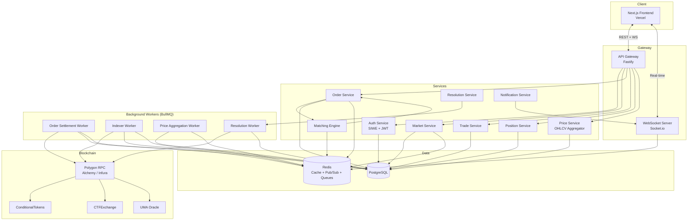
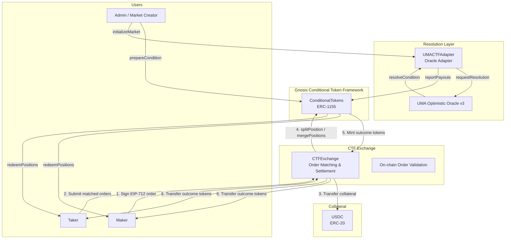
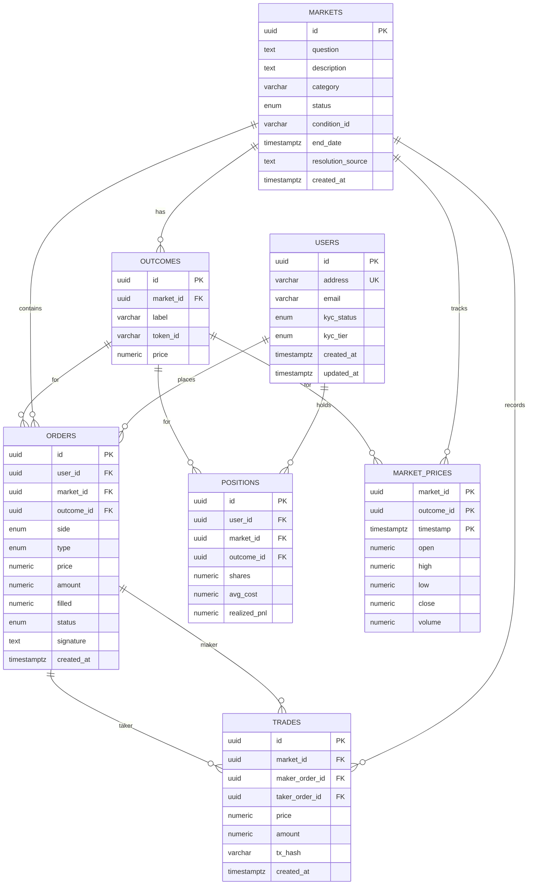
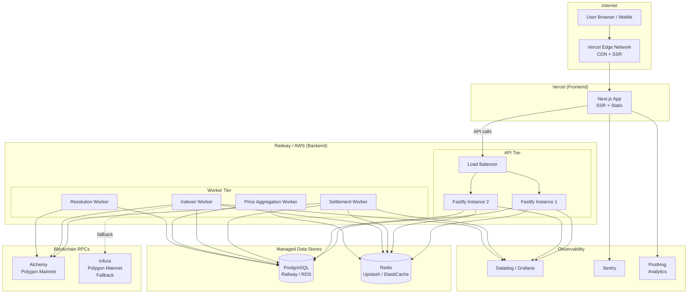
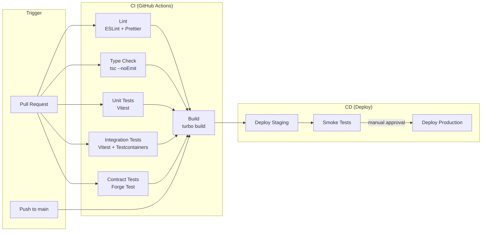

# Architecture Document — Prediction Markets Platform

## Table of Contents

1. [System Architecture Overview](#1-system-architecture-overview)
2. [Smart Contract Architecture](#2-smart-contract-architecture)
3. [Data Model (PostgreSQL)](#3-data-model-postgresql)
4. [API Design](#4-api-design)
5. [Infrastructure Diagram](#5-infrastructure-diagram)
6. [CI/CD Pipeline](#6-cicd-pipeline)

---

## 1. System Architecture Overview



### Component Descriptions

| Component | Responsibility |
|---|---|
| **API Gateway (Fastify)** | Request routing, rate limiting, JWT validation, request logging |
| **WebSocket Server (Socket.io)** | Real-time orderbook updates, trade feed, price ticks, user notifications |
| **Auth Service** | Sign-In with Ethereum (SIWE), JWT issuance and refresh, nonce management |
| **Market Service** | CRUD for markets and outcomes, market lifecycle (open, paused, closed, resolved) |
| **Order Service** | Order validation, signature verification (EIP-712), order lifecycle |
| **Matching Engine** | Off-chain CLOB matching, price-time priority, partial fills |
| **Trade Service** | Trade recording, trade history queries |
| **Position Service** | User position tracking, PnL calculations |
| **Price Service** | OHLCV candle aggregation, tick data |
| **Resolution Service** | Market resolution via UMA oracle, payout distribution |
| **Order Settlement Worker** | Batches matched orders and submits on-chain via CTFExchange |
| **Indexer Worker** | Listens to on-chain events (Transfer, TradeSettled, ConditionResolution) and syncs to DB |
| **Price Aggregation Worker** | Aggregates tick-level trades into OHLCV candles (1m, 5m, 15m, 1h, 1d) |
| **Resolution Worker** | Monitors UMA oracle for resolution outcomes, triggers payout |

---

## 2. Smart Contract Architecture



### Order Lifecycle: From Signature to Settlement

```
1. ORDER CREATION
   User signs an EIP-712 typed data struct off-chain:
   {
     maker, taker (0x0 for any), tokenId, makerAmount, takerAmount,
     expiration, nonce, feeRateBps, side (BUY/SELL), signatureType
   }
   The signed order is submitted to our API (never on-chain at this stage).

2. ORDER MATCHING (Off-chain)
   The Matching Engine maintains an in-memory orderbook per market/outcome.
   Incoming orders are matched against resting orders using price-time priority.
   Partial fills are supported — remaining quantity stays on the book.

3. TRADE SETTLEMENT (On-chain — batched)
   The Order Settlement Worker batches matched order pairs and calls:
     CTFExchange.matchOrders(Order makerOrder, Order takerOrder)
   This single transaction:
     a. Verifies both EIP-712 signatures on-chain
     b. Transfers USDC collateral from both parties
     c. Calls ConditionalTokens.splitPosition() to mint outcome tokens
     d. Distributes outcome tokens to maker and taker
     e. Emits OrderFilled / TradeSettled events

4. INDEXER SYNC
   The Indexer Worker picks up on-chain events and updates:
     - orders table (filled amount, status)
     - trades table (tx_hash confirmation)
     - positions table (share balances, avg cost)

5. MARKET RESOLUTION
   When the market end_date is reached:
     a. Resolution Service calls UMACTFAdapter.requestResolution(questionId)
     b. UMA Optimistic Oracle has a challenge period (typically 2h)
     c. Once finalized, UMACTFAdapter calls ConditionalTokens.reportPayouts()
     d. Users can call ConditionalTokens.redeemPositions() to claim USDC

6. REDEMPTION
   Winning outcome token holders redeem 1:1 for USDC collateral.
   Losing outcome tokens become worthless (redeemable for 0).
```

### Key Contract Addresses (Polygon Mainnet — Reference)

| Contract | Description |
|---|---|
| `ConditionalTokens` | Gnosis CTF — mints/burns ERC-1155 outcome tokens |
| `CTFExchange` | Polymarket exchange — validates signatures, settles trades |
| `UMACTFAdapter` | Bridges UMA oracle resolutions to ConditionalTokens |
| `USDC` | Circle USDC on Polygon — collateral token |

---

## 3. Data Model (PostgreSQL)

```sql
-- ============================================================
-- EXTENSIONS
-- ============================================================
CREATE EXTENSION IF NOT EXISTS "uuid-ossp";
CREATE EXTENSION IF NOT EXISTS "pgcrypto";

-- ============================================================
-- ENUMS
-- ============================================================
CREATE TYPE kyc_status AS ENUM ('none', 'pending', 'approved', 'rejected');
CREATE TYPE kyc_tier AS ENUM ('tier_0', 'tier_1', 'tier_2');
CREATE TYPE market_status AS ENUM ('draft', 'active', 'paused', 'closed', 'resolved');
CREATE TYPE order_side AS ENUM ('buy', 'sell');
CREATE TYPE order_type AS ENUM ('limit', 'market');
CREATE TYPE order_status AS ENUM ('open', 'partially_filled', 'filled', 'cancelled', 'expired');

-- ============================================================
-- USERS
-- ============================================================
CREATE TABLE users (
    id              UUID PRIMARY KEY DEFAULT uuid_generate_v4(),
    address         VARCHAR(42) NOT NULL UNIQUE,   -- Ethereum address (0x...)
    email           VARCHAR(255),
    kyc_status      kyc_status NOT NULL DEFAULT 'none',
    kyc_tier        kyc_tier NOT NULL DEFAULT 'tier_0',
    created_at      TIMESTAMPTZ NOT NULL DEFAULT NOW(),
    updated_at      TIMESTAMPTZ NOT NULL DEFAULT NOW()
);

CREATE INDEX idx_users_address ON users (address);

-- ============================================================
-- MARKETS
-- ============================================================
CREATE TABLE markets (
    id                  UUID PRIMARY KEY DEFAULT uuid_generate_v4(),
    question            TEXT NOT NULL,
    description         TEXT,
    category            VARCHAR(100),
    status              market_status NOT NULL DEFAULT 'draft',
    condition_id        VARCHAR(66),              -- bytes32 from ConditionalTokens
    end_date            TIMESTAMPTZ NOT NULL,
    resolution_source   TEXT,                     -- URL or description of resolution criteria
    created_at          TIMESTAMPTZ NOT NULL DEFAULT NOW()
);

CREATE INDEX idx_markets_status ON markets (status);
CREATE INDEX idx_markets_category ON markets (category);
CREATE INDEX idx_markets_end_date ON markets (end_date);

-- ============================================================
-- OUTCOMES
-- ============================================================
CREATE TABLE outcomes (
    id          UUID PRIMARY KEY DEFAULT uuid_generate_v4(),
    market_id   UUID NOT NULL REFERENCES markets(id) ON DELETE CASCADE,
    label       VARCHAR(100) NOT NULL,            -- e.g. "Yes", "No"
    token_id    VARCHAR(78),                      -- uint256 as string — ERC-1155 token ID
    price       NUMERIC(10, 4) NOT NULL DEFAULT 0.5000,
    UNIQUE (market_id, label)
);

CREATE INDEX idx_outcomes_market_id ON outcomes (market_id);

-- ============================================================
-- ORDERS
-- ============================================================
CREATE TABLE orders (
    id          UUID PRIMARY KEY DEFAULT uuid_generate_v4(),
    user_id     UUID NOT NULL REFERENCES users(id),
    market_id   UUID NOT NULL REFERENCES markets(id),
    outcome_id  UUID NOT NULL REFERENCES outcomes(id),
    side        order_side NOT NULL,
    type        order_type NOT NULL DEFAULT 'limit',
    price       NUMERIC(10, 4) NOT NULL,          -- 0.0001 to 0.9999
    amount      NUMERIC(18, 6) NOT NULL,           -- number of shares
    filled      NUMERIC(18, 6) NOT NULL DEFAULT 0,
    status      order_status NOT NULL DEFAULT 'open',
    signature   TEXT NOT NULL,                     -- EIP-712 signature
    created_at  TIMESTAMPTZ NOT NULL DEFAULT NOW()
);

CREATE INDEX idx_orders_user_id ON orders (user_id);
CREATE INDEX idx_orders_market_outcome ON orders (market_id, outcome_id);
CREATE INDEX idx_orders_status ON orders (status);
CREATE INDEX idx_orders_book ON orders (market_id, outcome_id, side, price, created_at)
    WHERE status IN ('open', 'partially_filled');

-- ============================================================
-- TRADES
-- ============================================================
CREATE TABLE trades (
    id              UUID PRIMARY KEY DEFAULT uuid_generate_v4(),
    market_id       UUID NOT NULL REFERENCES markets(id),
    maker_order_id  UUID NOT NULL REFERENCES orders(id),
    taker_order_id  UUID NOT NULL REFERENCES orders(id),
    price           NUMERIC(10, 4) NOT NULL,
    amount          NUMERIC(18, 6) NOT NULL,
    tx_hash         VARCHAR(66),                   -- on-chain settlement tx hash
    created_at      TIMESTAMPTZ NOT NULL DEFAULT NOW()
);

CREATE INDEX idx_trades_market_id ON trades (market_id);
CREATE INDEX idx_trades_created_at ON trades (market_id, created_at);

-- ============================================================
-- POSITIONS
-- ============================================================
CREATE TABLE positions (
    id              UUID PRIMARY KEY DEFAULT uuid_generate_v4(),
    user_id         UUID NOT NULL REFERENCES users(id),
    market_id       UUID NOT NULL REFERENCES markets(id),
    outcome_id      UUID NOT NULL REFERENCES outcomes(id),
    shares          NUMERIC(18, 6) NOT NULL DEFAULT 0,
    avg_cost        NUMERIC(10, 4) NOT NULL DEFAULT 0,
    realized_pnl    NUMERIC(18, 6) NOT NULL DEFAULT 0,
    UNIQUE (user_id, market_id, outcome_id)
);

CREATE INDEX idx_positions_user_id ON positions (user_id);
CREATE INDEX idx_positions_market ON positions (market_id, outcome_id);

-- ============================================================
-- MARKET PRICES (OHLCV candles)
-- ============================================================
CREATE TABLE market_prices (
    market_id   UUID NOT NULL REFERENCES markets(id),
    outcome_id  UUID NOT NULL REFERENCES outcomes(id),
    timestamp   TIMESTAMPTZ NOT NULL,              -- candle open time
    open        NUMERIC(10, 4) NOT NULL,
    high        NUMERIC(10, 4) NOT NULL,
    low         NUMERIC(10, 4) NOT NULL,
    close       NUMERIC(10, 4) NOT NULL,
    volume      NUMERIC(18, 6) NOT NULL DEFAULT 0,
    PRIMARY KEY (market_id, outcome_id, timestamp)
);

CREATE INDEX idx_market_prices_lookup ON market_prices (market_id, outcome_id, timestamp DESC);
```

### Entity Relationship Diagram



---

## 4. API Design

### Authentication

All authenticated endpoints require a `Bearer` token in the `Authorization` header.
Tokens are issued via SIWE (Sign-In with Ethereum) flow.

### Endpoints

#### Auth

| Method | Path | Description | Auth |
|---|---|---|---|
| `POST` | `/auth/nonce` | Request a nonce for SIWE. Body: `{ address }`. Returns `{ nonce }`. | No |
| `POST` | `/auth/verify` | Verify SIWE signature. Body: `{ message, signature }`. Returns `{ token, refreshToken, user }`. | No |

#### Users

| Method | Path | Description | Auth |
|---|---|---|---|
| `GET` | `/users/me` | Get current user profile. Returns user object with KYC status. | Yes |
| `PATCH` | `/users/me` | Update user profile (email, display name). Body: `{ email?, displayName? }`. | Yes |
| `POST` | `/users/kyc` | Submit KYC verification. Body: `{ tier, documentType, documentData }`. Returns `{ kycId, status }`. | Yes |

#### Markets

| Method | Path | Description | Auth |
|---|---|---|---|
| `GET` | `/markets` | List markets. Query params: `status`, `category`, `search`, `sort`, `page`, `limit`. | No |
| `GET` | `/markets/:id` | Get market detail including outcomes and current prices. | No |
| `POST` | `/markets` | Create a new market (admin only). Body: `{ question, description, category, endDate, resolutionSource, outcomes[] }`. | Yes (Admin) |

#### Orders

| Method | Path | Description | Auth |
|---|---|---|---|
| `POST` | `/orders` | Place a new order. Body: `{ marketId, outcomeId, side, type, price, amount, signature }`. | Yes |
| `GET` | `/orders` | List user's orders. Query: `marketId?`, `status?`, `page`, `limit`. | Yes |
| `DELETE` | `/orders/:id` | Cancel an open order. | Yes |
| `GET` | `/orders/book/:marketId` | Get the full orderbook for a market. Query: `outcomeId?`. Returns `{ bids[], asks[] }`. | No |

#### Trades

| Method | Path | Description | Auth |
|---|---|---|---|
| `GET` | `/trades/:marketId` | Get trade history for a market. Query: `outcomeId?`, `page`, `limit`. | No |

#### Positions

| Method | Path | Description | Auth |
|---|---|---|---|
| `GET` | `/positions` | Get user's positions across all markets. Query: `marketId?`, `status?`. | Yes |

#### Prices

| Method | Path | Description | Auth |
|---|---|---|---|
| `GET` | `/prices/:marketId/candles` | Get OHLCV candle data. Query: `outcomeId`, `interval` (1m, 5m, 15m, 1h, 1d), `from`, `to`. | No |

### WebSocket Channels

Connection: `wss://api.example.com` with Socket.io.
Authentication: pass JWT as `auth.token` on connection.

| Channel | Payload | Description |
|---|---|---|
| `orderbook:{marketId}` | `{ outcomeId, bids: [price, amount][], asks: [price, amount][] }` | Real-time orderbook snapshots and deltas |
| `trades:{marketId}` | `{ id, outcomeId, price, amount, side, timestamp }` | Live trade feed |
| `prices:{marketId}` | `{ outcomeId, price, timestamp, volume24h }` | Tick-level price updates |
| `user:{userId}` | `{ type: 'order_update' \| 'trade' \| 'position', data: {...} }` | Private channel — order fills, position changes |

### Error Response Format

```json
{
  "statusCode": 400,
  "error": "Bad Request",
  "message": "Price must be between 0.0001 and 0.9999"
}
```

### Rate Limits

| Tier | Requests/min | WebSocket connections |
|---|---|---|
| Unauthenticated | 30 | 2 |
| Authenticated (tier_0) | 120 | 5 |
| Authenticated (tier_1+) | 600 | 20 |

---

## 5. Infrastructure Diagram



### Environment Summary

| Component | Service | Tier |
|---|---|---|
| Frontend | Vercel Pro | SSR + Edge Functions |
| Backend API | Railway (or AWS ECS Fargate) | 2 instances, autoscale |
| Background Workers | Railway (or AWS ECS Fargate) | 1 instance per worker type |
| PostgreSQL | Railway Postgres (or AWS RDS) | 4 vCPU, 16GB RAM |
| Redis | Upstash (or AWS ElastiCache) | 256MB, persistence enabled |
| Blockchain RPC | Alchemy Growth | Polygon Mainnet, 300M CU/mo |
| Monitoring | Datadog + Sentry | APM, logs, error tracking |

---

## 6. CI/CD Pipeline

### Pipeline Overview



### GitHub Actions Workflow

```yaml
# .github/workflows/ci.yml
name: CI/CD

on:
  push:
    branches: [main]
  pull_request:
    branches: [main]

concurrency:
  group: ${{ github.workflow }}-${{ github.ref }}
  cancel-in-progress: true

env:
  NODE_VERSION: "20"
  PNPM_VERSION: "9"

jobs:
  lint:
    name: Lint & Format
    runs-on: ubuntu-latest
    steps:
      - uses: actions/checkout@v4
      - uses: pnpm/action-setup@v4
        with:
          version: ${{ env.PNPM_VERSION }}
      - uses: actions/setup-node@v4
        with:
          node-version: ${{ env.NODE_VERSION }}
          cache: "pnpm"
      - run: pnpm install --frozen-lockfile
      - run: pnpm lint
      - run: pnpm format:check

  typecheck:
    name: Type Check
    runs-on: ubuntu-latest
    steps:
      - uses: actions/checkout@v4
      - uses: pnpm/action-setup@v4
        with:
          version: ${{ env.PNPM_VERSION }}
      - uses: actions/setup-node@v4
        with:
          node-version: ${{ env.NODE_VERSION }}
          cache: "pnpm"
      - run: pnpm install --frozen-lockfile
      - run: pnpm typecheck

  test-unit:
    name: Unit Tests
    runs-on: ubuntu-latest
    steps:
      - uses: actions/checkout@v4
      - uses: pnpm/action-setup@v4
        with:
          version: ${{ env.PNPM_VERSION }}
      - uses: actions/setup-node@v4
        with:
          node-version: ${{ env.NODE_VERSION }}
          cache: "pnpm"
      - run: pnpm install --frozen-lockfile
      - run: pnpm test

  test-contracts:
    name: Contract Tests
    runs-on: ubuntu-latest
    steps:
      - uses: actions/checkout@v4
      - uses: foundry-rs/foundry-toolchain@v1
      - working-directory: packages/contracts
        run: forge test -vvv

  build:
    name: Build
    runs-on: ubuntu-latest
    needs: [lint, typecheck, test-unit, test-contracts]
    steps:
      - uses: actions/checkout@v4
      - uses: pnpm/action-setup@v4
        with:
          version: ${{ env.PNPM_VERSION }}
      - uses: actions/setup-node@v4
        with:
          node-version: ${{ env.NODE_VERSION }}
          cache: "pnpm"
      - run: pnpm install --frozen-lockfile
      - run: pnpm build

  deploy-staging:
    name: Deploy Staging
    runs-on: ubuntu-latest
    needs: [build]
    if: github.ref == 'refs/heads/main'
    environment: staging
    steps:
      - uses: actions/checkout@v4
      - name: Deploy Backend to Railway (Staging)
        run: railway up --service backend --environment staging
        env:
          RAILWAY_TOKEN: ${{ secrets.RAILWAY_TOKEN }}
      - name: Deploy Frontend to Vercel (Preview)
        uses: amondnet/vercel-action@v25
        with:
          vercel-token: ${{ secrets.VERCEL_TOKEN }}
          vercel-org-id: ${{ secrets.VERCEL_ORG_ID }}
          vercel-project-id: ${{ secrets.VERCEL_PROJECT_ID }}

  deploy-production:
    name: Deploy Production
    runs-on: ubuntu-latest
    needs: [deploy-staging]
    if: github.ref == 'refs/heads/main'
    environment: production
    steps:
      - uses: actions/checkout@v4
      - name: Deploy Backend to Railway (Production)
        run: railway up --service backend --environment production
        env:
          RAILWAY_TOKEN: ${{ secrets.RAILWAY_TOKEN }}
      - name: Deploy Frontend to Vercel (Production)
        uses: amondnet/vercel-action@v25
        with:
          vercel-token: ${{ secrets.VERCEL_TOKEN }}
          vercel-org-id: ${{ secrets.VERCEL_ORG_ID }}
          vercel-project-id: ${{ secrets.VERCEL_PROJECT_ID }}
          vercel-args: "--prod"
```

### Branch Strategy

| Branch | Purpose | Deploy target |
|---|---|---|
| `main` | Production-ready code | Staging (auto) -> Production (manual approval) |
| `feature/*` | Feature development | Preview (Vercel) |
| `fix/*` | Bug fixes | Preview (Vercel) |
| `release/*` | Release candidates | Staging |
