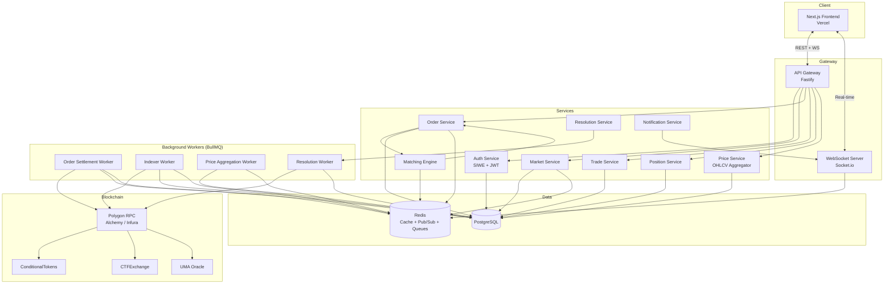
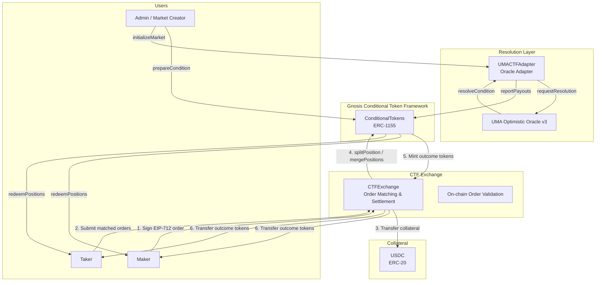
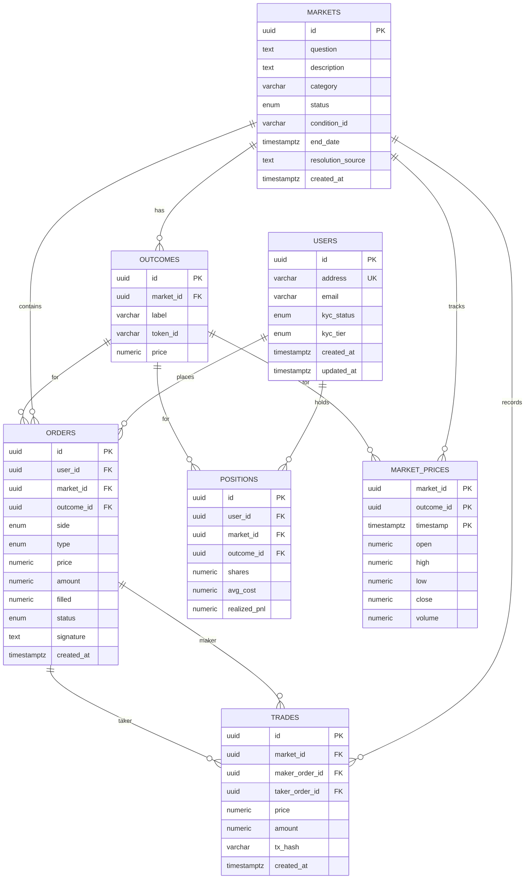
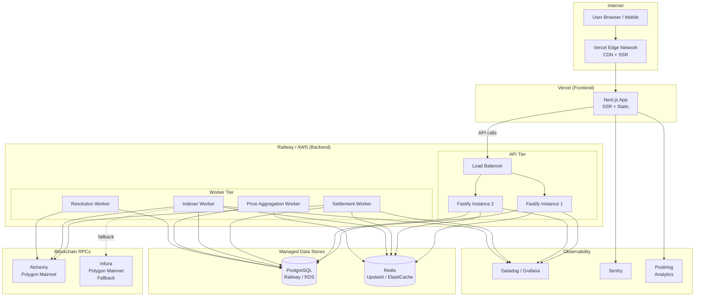
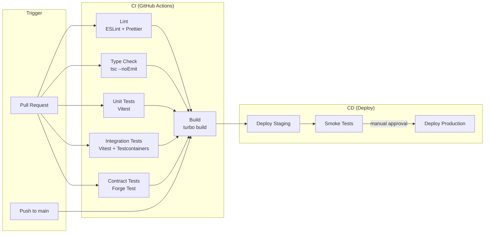

# Architecture Document — Prediction Markets Platform

## Table of Contents

1. [System Architecture Overview](#1-system-architecture-overview)
2. [Smart Contract Architecture](#2-smart-contract-architecture)
3. [Data Model (PostgreSQL)](#3-data-model-postgresql)
4. [API Design](#4-api-design)
5. [Infrastructure Diagram](#5-infrastructure-diagram)
6. [CI/CD Pipeline](#6-cicd-pipeline)

---

## 1. System Architecture Overview



### Component Descriptions

| Component | Responsibility |
|---|---|
| **API Gateway (Fastify)** | Request routing, rate limiting, JWT validation, request logging |
| **WebSocket Server (Socket.io)** | Real-time orderbook updates, trade feed, price ticks, user notifications |
| **Auth Service** | Sign-In with Ethereum (SIWE), JWT issuance and refresh, nonce management |
| **Market Service** | CRUD for markets and outcomes, market lifecycle (open, paused, closed, resolved) |
| **Order Service** | Order validation, signature verification (EIP-712), order lifecycle |
| **Matching Engine** | Off-chain CLOB matching, price-time priority, partial fills |
| **Trade Service** | Trade recording, trade history queries |
| **Position Service** | User position tracking, PnL calculations |
| **Price Service** | OHLCV candle aggregation, tick data |
| **Resolution Service** | Market resolution via UMA oracle, payout distribution |
| **Order Settlement Worker** | Batches matched orders and submits on-chain via CTFExchange |
| **Indexer Worker** | Listens to on-chain events (Transfer, TradeSettled, ConditionResolution) and syncs to DB |
| **Price Aggregation Worker** | Aggregates tick-level trades into OHLCV candles (1m, 5m, 15m, 1h, 1d) |
| **Resolution Worker** | Monitors UMA oracle for resolution outcomes, triggers payout |
| **Payment Service** | Abstraction layer for deposits/withdrawals. Implements PaymentProvider interface for crypto and fiat paths |
| **Balance Service** | Atomic balance operations: credit, debit, lock, unlock. All mutations use SELECT FOR UPDATE |
| **Webhook Processing Worker** | Procesa webhooks de PSPs (MoonPay, Transak), acredita balances |
| **Reconciliation Cron** | Verifica consistencia entre PSPs y balances internos cada 15 min |

### Payment Provider Architecture

El motor de trading opera en **unidades internas normalizadas**, agnóstico al origen del dinero. La capa de pagos abstrae las diferencias entre crypto y fiat.

```
PaymentProvider (interface)
├── initiateDeposit(user, amount, currency) → { redirectUrl?, widgetConfig?, pendingTxId }
├── confirmDeposit(webhookPayload) → { userId, amount, currency, externalId }
├── initiateWithdrawal(user, amount, currency, destination) → { pendingTxId }
├── getTransactionStatus(externalId) → PaymentStatus
└── getSupportedCurrencies() → Currency[]

BalanceService (internal, NOT per-provider)
├── credit(user, amount, currency, reason, referenceId) → Balance
├── debit(user, amount, currency, reason, referenceId) → Balance
├── lock(user, amount, currency) → Balance
├── unlock(user, amount, currency) → Balance
└── getBalance(user, currency?) → { available, locked }[]

Implementations:
├── CryptoProvider    → Polygon USDC (wallet connect, on-chain transfer)
├── MoonPayProvider   → Fiat via MoonPay (card/bank → USDC conversion)
├── TransakProvider   → Fiat via Transak (fallback PSP)
└── [future]          → Additional PSPs as needed
```

**Flujo fiat**: Usuario deposita USD con tarjeta → PSP convierte a USDC → USDC llega a proxy wallet del usuario → balance interno se acredita. El usuario ve "USD" en la UI, nunca toca crypto directamente.

**Flujo crypto**: Usuario conecta wallet → transfiere USDC a la plataforma → balance interno se acredita.

### Multibranding Architecture

La plataforma soporta múltiples marcas sobre un **único engine de liquidez** (order book compartido).

```
brand_config {
  brand_id          -- identificador único
  name              -- nombre de la marca
  allowed_currencies -- [USD, USDC, BRL, ...]
  allowed_markets   -- categorías o mercados específicos
  kyc_required      -- nivel mínimo de KYC
  payment_methods   -- [crypto, card, bank_transfer]
  theme             -- colores, logo, tipografía
  jurisdiction      -- reglas de geo-blocking específicas
}
```

Cada request HTTP lleva un `brand_id` (vía header, subdomain, o config del frontend). El backend sirve la experiencia correcta sin código específico por marca. Añadir una marca nueva es configuración, no deploy.

> **Nota:** En el MVP se implementa una sola marca (Praxis). La arquitectura queda preparada para multibranding sin implementarlo activamente.

### Webhook Processing Architecture

Los PSPs (MoonPay, Transak) notifican eventos de pago via webhooks HTTP. Para garantizar delivery confiable:

1. **Ingestion**: El endpoint HTTP valida la firma del PSP, persiste el evento crudo en `webhook_events`, y encola en BullMQ. Responde 200 inmediatamente.
2. **Processing**: El Webhook Processing Worker consume de la cola, actualiza `payment_transactions` y acredita `user_balances` via BalanceService.
3. **Idempotencia**: Constraint UNIQUE en `(provider, external_id, event_type)` previene procesamiento duplicado.
4. **Reintentos**: BullMQ con backoff exponencial (5 intentos). Dead Letter Queue para eventos que fallan persistentemente.
5. **Reconciliacion**: Cron cada 15 minutos consulta APIs de PSPs y cruza contra registros locales para detectar webhooks perdidos.

---

## 2. Smart Contract Architecture



### Order Lifecycle: From Signature to Settlement

```
1. ORDER CREATION
   User signs an EIP-712 typed data struct off-chain:
   {
     maker, taker (0x0 for any), tokenId, makerAmount, takerAmount,
     expiration, nonce, feeRateBps, side (BUY/SELL), signatureType
   }
   The signed order is submitted to our API (never on-chain at this stage).

2. ORDER MATCHING (Off-chain)
   The Matching Engine maintains an in-memory orderbook per market/outcome.
   Incoming orders are matched against resting orders using price-time priority.
   Partial fills are supported — remaining quantity stays on the book.

3. TRADE SETTLEMENT (On-chain — batched)
   The Order Settlement Worker batches matched order pairs and calls:
     CTFExchange.matchOrders(Order makerOrder, Order takerOrder)
   This single transaction:
     a. Verifies both EIP-712 signatures on-chain
     b. Transfers USDC collateral from both parties
     c. Calls ConditionalTokens.splitPosition() to mint outcome tokens
     d. Distributes outcome tokens to maker and taker
     e. Emits OrderFilled / TradeSettled events

4. INDEXER SYNC
   The Indexer Worker picks up on-chain events and updates:
     - orders table (filled amount, status)
     - trades table (tx_hash confirmation)
     - positions table (share balances, avg cost)

5. MARKET RESOLUTION
   When the market end_date is reached:
     a. Resolution Service calls UMACTFAdapter.requestResolution(questionId)
     b. UMA Optimistic Oracle has a challenge period (typically 2h)
     c. Once finalized, UMACTFAdapter calls ConditionalTokens.reportPayouts()
     d. Users can call ConditionalTokens.redeemPositions() to claim USDC

6. REDEMPTION
   Winning outcome token holders redeem 1:1 for USDC collateral.
   Losing outcome tokens become worthless (redeemable for 0).
```

### Key Contract Addresses (Polygon Mainnet — Reference)

| Contract | Description |
|---|---|
| `ConditionalTokens` | Gnosis CTF — mints/burns ERC-1155 outcome tokens |
| `CTFExchange` | Polymarket exchange — validates signatures, settles trades |
| `UMACTFAdapter` | Bridges UMA oracle resolutions to ConditionalTokens |
| `USDC` | Circle USDC on Polygon — collateral token |

---

## 3. Data Model (PostgreSQL)

```sql
-- ============================================================
-- EXTENSIONS
-- ============================================================
CREATE EXTENSION IF NOT EXISTS "uuid-ossp";
CREATE EXTENSION IF NOT EXISTS "pgcrypto";

-- ============================================================
-- ENUMS
-- ============================================================
CREATE TYPE kyc_status AS ENUM ('none', 'pending', 'approved', 'rejected');
CREATE TYPE kyc_tier AS ENUM ('tier_0', 'tier_1', 'tier_2');
CREATE TYPE market_status AS ENUM ('draft', 'active', 'paused', 'closed', 'resolved');
CREATE TYPE order_side AS ENUM ('buy', 'sell');
CREATE TYPE order_type AS ENUM ('limit', 'market');
CREATE TYPE order_status AS ENUM ('open', 'partially_filled', 'filled', 'cancelled', 'expired');
CREATE TYPE currency_type AS ENUM ('USDC', 'USD', 'EUR', 'BRL');
CREATE TYPE payment_source AS ENUM ('crypto_wallet', 'fiat_card', 'fiat_bank_transfer', 'internal');

-- ============================================================
-- USERS
-- ============================================================
CREATE TABLE users (
    id              UUID PRIMARY KEY DEFAULT uuid_generate_v4(),
    address         VARCHAR(42) UNIQUE,            -- Ethereum address (0x...), NULL for fiat-only users
    email           VARCHAR(255),
    auth_method     VARCHAR(20) NOT NULL DEFAULT 'wallet', -- 'wallet' | 'email' | 'google'
    brand_id        VARCHAR(50) NOT NULL DEFAULT 'praxis',
    kyc_status      kyc_status NOT NULL DEFAULT 'none',
    kyc_tier        kyc_tier NOT NULL DEFAULT 'tier_0',
    created_at      TIMESTAMPTZ NOT NULL DEFAULT NOW(),
    updated_at      TIMESTAMPTZ NOT NULL DEFAULT NOW()
);

CREATE INDEX idx_users_address ON users (address);
CREATE INDEX idx_users_brand ON users (brand_id);

-- ============================================================
-- USER BALANCES (multi-currency, agnóstico al origen)
-- ============================================================
CREATE TABLE user_balances (
    id              UUID PRIMARY KEY DEFAULT uuid_generate_v4(),
    user_id         UUID NOT NULL REFERENCES users(id),
    currency        currency_type NOT NULL DEFAULT 'USDC',
    available       NUMERIC(18, 6) NOT NULL DEFAULT 0,  -- disponible para operar
    locked          NUMERIC(18, 6) NOT NULL DEFAULT 0,  -- bloqueado en órdenes abiertas
    updated_at      TIMESTAMPTZ NOT NULL DEFAULT NOW(),
    UNIQUE (user_id, currency),
    CHECK (available >= 0),
    CHECK (locked >= 0)
);

CREATE INDEX idx_user_balances_user ON user_balances (user_id);

-- ============================================================
-- PAYMENT TRANSACTIONS (registro de depósitos/retiros)
-- ============================================================
CREATE TABLE payment_transactions (
    id              UUID PRIMARY KEY DEFAULT uuid_generate_v4(),
    user_id         UUID NOT NULL REFERENCES users(id),
    type            VARCHAR(20) NOT NULL,              -- 'deposit' | 'withdrawal'
    source          payment_source NOT NULL,
    currency        currency_type NOT NULL,
    amount          NUMERIC(18, 6) NOT NULL,
    fee             NUMERIC(18, 6) NOT NULL DEFAULT 0,
    status          VARCHAR(20) NOT NULL DEFAULT 'pending', -- 'pending' | 'completed' | 'failed'
    external_id     VARCHAR(255),                      -- PSP transaction ID or tx_hash
    created_at      TIMESTAMPTZ NOT NULL DEFAULT NOW(),
    completed_at    TIMESTAMPTZ
);

CREATE INDEX idx_payment_tx_user ON payment_transactions (user_id);
CREATE INDEX idx_payment_tx_status ON payment_transactions (status);

-- ============================================================
-- BRAND CONFIGS (multibranding preparado)
-- ============================================================
CREATE TABLE brand_configs (
    brand_id            VARCHAR(50) PRIMARY KEY,
    name                VARCHAR(100) NOT NULL,
    allowed_currencies  JSONB NOT NULL DEFAULT '["USDC"]',
    allowed_categories  JSONB,                         -- NULL = all categories
    kyc_required        kyc_tier NOT NULL DEFAULT 'tier_0',
    payment_methods     JSONB NOT NULL DEFAULT '["crypto_wallet"]',
    theme               JSONB,                         -- colores, logo URL, tipografía
    jurisdiction        VARCHAR(10),                   -- reglas de geo-blocking
    active              BOOLEAN NOT NULL DEFAULT true,
    created_at          TIMESTAMPTZ NOT NULL DEFAULT NOW()
);

-- Seed default brand
INSERT INTO brand_configs (brand_id, name, allowed_currencies, payment_methods)
VALUES ('praxis', 'Praxis', '["USDC", "USD"]', '["crypto_wallet", "fiat_card"]');

-- ============================================================
-- WEBHOOK EVENTS (idempotency + audit trail de PSPs)
-- ============================================================
CREATE TABLE webhook_events (
    id              UUID PRIMARY KEY DEFAULT uuid_generate_v4(),
    provider        VARCHAR(50) NOT NULL,
    external_id     VARCHAR(255) NOT NULL,
    event_type      VARCHAR(100) NOT NULL,
    payload         JSONB NOT NULL,
    signature_valid BOOLEAN NOT NULL,
    processed       BOOLEAN NOT NULL DEFAULT false,
    created_at      TIMESTAMPTZ NOT NULL DEFAULT NOW(),
    UNIQUE (provider, external_id, event_type)
);

-- ============================================================
-- LEDGER ENTRIES (double-entry bookkeeping para auditoría)
-- ============================================================
CREATE TABLE ledger_entries (
    id              UUID PRIMARY KEY DEFAULT uuid_generate_v4(),
    user_id         UUID NOT NULL REFERENCES users(id),
    entry_type      VARCHAR(50) NOT NULL,
    currency        currency_type NOT NULL,
    debit           NUMERIC(18, 6) NOT NULL DEFAULT 0,
    credit          NUMERIC(18, 6) NOT NULL DEFAULT 0,
    balance_after   NUMERIC(18, 6) NOT NULL,
    reference_type  VARCHAR(50),
    reference_id    UUID,
    created_at      TIMESTAMPTZ NOT NULL DEFAULT NOW(),
    CHECK (debit >= 0 AND credit >= 0),
    CHECK (debit > 0 OR credit > 0)
);

CREATE INDEX idx_ledger_user ON ledger_entries (user_id, created_at);
CREATE INDEX idx_ledger_reference ON ledger_entries (reference_type, reference_id);

-- ============================================================
-- USER AUTH METHODS (múltiples métodos por usuario)
-- ============================================================
CREATE TABLE user_auth_methods (
    id              UUID PRIMARY KEY DEFAULT uuid_generate_v4(),
    user_id         UUID NOT NULL REFERENCES users(id),
    method          VARCHAR(20) NOT NULL,
    identifier      VARCHAR(255) NOT NULL,
    verified        BOOLEAN NOT NULL DEFAULT false,
    created_at      TIMESTAMPTZ NOT NULL DEFAULT NOW(),
    UNIQUE (method, identifier)
);

CREATE INDEX idx_auth_methods_user ON user_auth_methods (user_id);

-- ============================================================
-- PROXY WALLETS (Phase 2 — claves cifradas con AWS KMS)
-- ============================================================
CREATE TABLE proxy_wallets (
    id                  UUID PRIMARY KEY DEFAULT uuid_generate_v4(),
    user_id             UUID NOT NULL REFERENCES users(id) UNIQUE,
    address             VARCHAR(42) NOT NULL UNIQUE,
    encrypted_key       BYTEA NOT NULL,
    encrypted_dek       BYTEA NOT NULL,
    kms_key_id          VARCHAR(255) NOT NULL,
    created_at          TIMESTAMPTZ NOT NULL DEFAULT NOW()
);

-- ============================================================
-- ADMIN USERS (separados de traders, para el Admin Panel)
-- ============================================================
CREATE TABLE admin_users (
    id              UUID PRIMARY KEY DEFAULT uuid_generate_v4(),
    email           VARCHAR(255) NOT NULL UNIQUE,
    password_hash   TEXT NOT NULL,
    google_id       VARCHAR(100) UNIQUE,
    role            VARCHAR(30) NOT NULL DEFAULT 'viewer',
    totp_secret     TEXT,
    active          BOOLEAN NOT NULL DEFAULT true,
    created_at      TIMESTAMPTZ NOT NULL DEFAULT NOW(),
    updated_at      TIMESTAMPTZ NOT NULL DEFAULT NOW()
);

CREATE TABLE admin_audit_log (
    id              UUID PRIMARY KEY DEFAULT uuid_generate_v4(),
    admin_user_id   UUID NOT NULL REFERENCES admin_users(id),
    action          VARCHAR(100) NOT NULL,
    target_type     VARCHAR(50),
    target_id       UUID,
    details         JSONB,
    ip_address      VARCHAR(45),
    created_at      TIMESTAMPTZ NOT NULL DEFAULT NOW()
);

CREATE INDEX idx_audit_log_admin ON admin_audit_log (admin_user_id, created_at);
CREATE INDEX idx_audit_log_target ON admin_audit_log (target_type, target_id);

-- ============================================================
-- MARKETS
-- ============================================================
CREATE TABLE markets (
    id                  UUID PRIMARY KEY DEFAULT uuid_generate_v4(),
    question            TEXT NOT NULL,
    description         TEXT,
    category            VARCHAR(100),
    status              market_status NOT NULL DEFAULT 'draft',
    condition_id        VARCHAR(66),              -- bytes32 from ConditionalTokens
    end_date            TIMESTAMPTZ NOT NULL,
    resolution_source   TEXT,                     -- URL or description of resolution criteria
    created_at          TIMESTAMPTZ NOT NULL DEFAULT NOW()
);

CREATE INDEX idx_markets_status ON markets (status);
CREATE INDEX idx_markets_category ON markets (category);
CREATE INDEX idx_markets_end_date ON markets (end_date);

-- ============================================================
-- OUTCOMES
-- ============================================================
CREATE TABLE outcomes (
    id          UUID PRIMARY KEY DEFAULT uuid_generate_v4(),
    market_id   UUID NOT NULL REFERENCES markets(id) ON DELETE CASCADE,
    label       VARCHAR(100) NOT NULL,            -- e.g. "Yes", "No"
    token_id    VARCHAR(78),                      -- uint256 as string — ERC-1155 token ID
    price       NUMERIC(10, 4) NOT NULL DEFAULT 0.5000,
    UNIQUE (market_id, label)
);

CREATE INDEX idx_outcomes_market_id ON outcomes (market_id);

-- ============================================================
-- ORDERS
-- ============================================================
CREATE TABLE orders (
    id          UUID PRIMARY KEY DEFAULT uuid_generate_v4(),
    user_id     UUID NOT NULL REFERENCES users(id),
    market_id   UUID NOT NULL REFERENCES markets(id),
    outcome_id  UUID NOT NULL REFERENCES outcomes(id),
    side        order_side NOT NULL,
    type        order_type NOT NULL DEFAULT 'limit',
    price       NUMERIC(10, 4) NOT NULL,          -- 0.0001 to 0.9999
    amount      NUMERIC(18, 6) NOT NULL,           -- number of shares
    filled      NUMERIC(18, 6) NOT NULL DEFAULT 0,
    status      order_status NOT NULL DEFAULT 'open',
    signature   TEXT NOT NULL,                     -- EIP-712 signature
    created_at  TIMESTAMPTZ NOT NULL DEFAULT NOW()
);

CREATE INDEX idx_orders_user_id ON orders (user_id);
CREATE INDEX idx_orders_market_outcome ON orders (market_id, outcome_id);
CREATE INDEX idx_orders_status ON orders (status);
CREATE INDEX idx_orders_book ON orders (market_id, outcome_id, side, price, created_at)
    WHERE status IN ('open', 'partially_filled');

-- ============================================================
-- TRADES
-- ============================================================
CREATE TABLE trades (
    id              UUID PRIMARY KEY DEFAULT uuid_generate_v4(),
    market_id       UUID NOT NULL REFERENCES markets(id),
    maker_order_id  UUID NOT NULL REFERENCES orders(id),
    taker_order_id  UUID NOT NULL REFERENCES orders(id),
    price           NUMERIC(10, 4) NOT NULL,
    amount          NUMERIC(18, 6) NOT NULL,
    tx_hash         VARCHAR(66),                   -- on-chain settlement tx hash
    created_at      TIMESTAMPTZ NOT NULL DEFAULT NOW()
);

CREATE INDEX idx_trades_market_id ON trades (market_id);
CREATE INDEX idx_trades_created_at ON trades (market_id, created_at);

-- ============================================================
-- POSITIONS
-- ============================================================
CREATE TABLE positions (
    id              UUID PRIMARY KEY DEFAULT uuid_generate_v4(),
    user_id         UUID NOT NULL REFERENCES users(id),
    market_id       UUID NOT NULL REFERENCES markets(id),
    outcome_id      UUID NOT NULL REFERENCES outcomes(id),
    shares          NUMERIC(18, 6) NOT NULL DEFAULT 0,
    avg_cost        NUMERIC(10, 4) NOT NULL DEFAULT 0,
    realized_pnl    NUMERIC(18, 6) NOT NULL DEFAULT 0,
    UNIQUE (user_id, market_id, outcome_id)
);

CREATE INDEX idx_positions_user_id ON positions (user_id);
CREATE INDEX idx_positions_market ON positions (market_id, outcome_id);

-- ============================================================
-- MARKET PRICES (OHLCV candles)
-- ============================================================
CREATE TABLE market_prices (
    market_id   UUID NOT NULL REFERENCES markets(id),
    outcome_id  UUID NOT NULL REFERENCES outcomes(id),
    timestamp   TIMESTAMPTZ NOT NULL,              -- candle open time
    open        NUMERIC(10, 4) NOT NULL,
    high        NUMERIC(10, 4) NOT NULL,
    low         NUMERIC(10, 4) NOT NULL,
    close       NUMERIC(10, 4) NOT NULL,
    volume      NUMERIC(18, 6) NOT NULL DEFAULT 0,
    PRIMARY KEY (market_id, outcome_id, timestamp)
);

CREATE INDEX idx_market_prices_lookup ON market_prices (market_id, outcome_id, timestamp DESC);
```

### Entity Relationship Diagram



---

## 4. API Design

### Authentication

All authenticated endpoints require a `Bearer` token in the `Authorization` header.
Tokens are issued via SIWE (Sign-In with Ethereum) flow.

### Endpoints

#### Auth

| Method | Path | Description | Auth |
|---|---|---|---|
| `POST` | `/auth/nonce` | Request a nonce for SIWE. Body: `{ address }`. Returns `{ nonce }`. | No |
| `POST` | `/auth/verify` | Verify SIWE signature. Body: `{ message, signature }`. Returns `{ token, refreshToken, user }`. | No |

#### Users

| Method | Path | Description | Auth |
|---|---|---|---|
| `GET` | `/users/me` | Get current user profile. Returns user object with KYC status. | Yes |
| `PATCH` | `/users/me` | Update user profile (email, display name). Body: `{ email?, displayName? }`. | Yes |
| `POST` | `/users/kyc` | Submit KYC verification. Body: `{ tier, documentType, documentData }`. Returns `{ kycId, status }`. | Yes |

#### Markets

| Method | Path | Description | Auth |
|---|---|---|---|
| `GET` | `/markets` | List markets. Query params: `status`, `category`, `search`, `sort`, `page`, `limit`. | No |
| `GET` | `/markets/:id` | Get market detail including outcomes and current prices. | No |
| `POST` | `/markets` | Create a new market (admin only). Body: `{ question, description, category, endDate, resolutionSource, outcomes[] }`. | Yes (Admin) |

#### Orders

| Method | Path | Description | Auth |
|---|---|---|---|
| `POST` | `/orders` | Place a new order. Body: `{ marketId, outcomeId, side, type, price, amount, signature }`. | Yes |
| `GET` | `/orders` | List user's orders. Query: `marketId?`, `status?`, `page`, `limit`. | Yes |
| `DELETE` | `/orders/:id` | Cancel an open order. | Yes |
| `GET` | `/orders/book/:marketId` | Get the full orderbook for a market. Query: `outcomeId?`. Returns `{ bids[], asks[] }`. | No |

#### Trades

| Method | Path | Description | Auth |
|---|---|---|---|
| `GET` | `/trades/:marketId` | Get trade history for a market. Query: `outcomeId?`, `page`, `limit`. | No |

#### Positions

| Method | Path | Description | Auth |
|---|---|---|---|
| `GET` | `/positions` | Get user's positions across all markets. Query: `marketId?`, `status?`. | Yes |

#### Prices

| Method | Path | Description | Auth |
|---|---|---|---|
| `GET` | `/prices/:marketId/candles` | Get OHLCV candle data. Query: `outcomeId`, `interval` (1m, 5m, 15m, 1h, 1d), `from`, `to`. | No |

### WebSocket Channels

Connection: `wss://api.example.com` with Socket.io.
Authentication: pass JWT as `auth.token` on connection.

| Channel | Payload | Description |
|---|---|---|
| `orderbook:{marketId}` | `{ outcomeId, bids: [price, amount][], asks: [price, amount][] }` | Real-time orderbook snapshots and deltas |
| `trades:{marketId}` | `{ id, outcomeId, price, amount, side, timestamp }` | Live trade feed |
| `prices:{marketId}` | `{ outcomeId, price, timestamp, volume24h }` | Tick-level price updates |
| `user:{userId}` | `{ type: 'order_update' \| 'trade' \| 'position', data: {...} }` | Private channel — order fills, position changes |

### Error Response Format

```json
{
  "statusCode": 400,
  "error": "Bad Request",
  "message": "Price must be between 0.0001 and 0.9999"
}
```

### Rate Limits

| Tier | Requests/min | WebSocket connections |
|---|---|---|
| Unauthenticated | 30 | 2 |
| Authenticated (tier_0) | 120 | 5 |
| Authenticated (tier_1+) | 600 | 20 |

---

## 5. Infrastructure Diagram



### Environment Summary

| Component | Service | Tier |
|---|---|---|
| Frontend | Vercel Pro | SSR + Edge Functions |
| Backend API | Railway (or AWS ECS Fargate) | 2 instances, autoscale |
| Background Workers | Railway (or AWS ECS Fargate) | 1 instance per worker type |
| PostgreSQL | Railway Postgres (or AWS RDS) | 4 vCPU, 16GB RAM |
| Redis | Upstash (or AWS ElastiCache) | 256MB, persistence enabled |
| Blockchain RPC | Alchemy Growth | Polygon Mainnet, 300M CU/mo |
| Monitoring | Datadog + Sentry | APM, logs, error tracking |

---

## 6. CI/CD Pipeline

### Pipeline Overview



### GitHub Actions Workflow

```yaml
# .github/workflows/ci.yml
name: CI/CD

on:
  push:
    branches: [main]
  pull_request:
    branches: [main]

concurrency:
  group: ${{ github.workflow }}-${{ github.ref }}
  cancel-in-progress: true

env:
  NODE_VERSION: "20"
  PNPM_VERSION: "9"

jobs:
  lint:
    name: Lint & Format
    runs-on: ubuntu-latest
    steps:
      - uses: actions/checkout@v4
      - uses: pnpm/action-setup@v4
        with:
          version: ${{ env.PNPM_VERSION }}
      - uses: actions/setup-node@v4
        with:
          node-version: ${{ env.NODE_VERSION }}
          cache: "pnpm"
      - run: pnpm install --frozen-lockfile
      - run: pnpm lint
      - run: pnpm format:check

  typecheck:
    name: Type Check
    runs-on: ubuntu-latest
    steps:
      - uses: actions/checkout@v4
      - uses: pnpm/action-setup@v4
        with:
          version: ${{ env.PNPM_VERSION }}
      - uses: actions/setup-node@v4
        with:
          node-version: ${{ env.NODE_VERSION }}
          cache: "pnpm"
      - run: pnpm install --frozen-lockfile
      - run: pnpm typecheck

  test-unit:
    name: Unit Tests
    runs-on: ubuntu-latest
    steps:
      - uses: actions/checkout@v4
      - uses: pnpm/action-setup@v4
        with:
          version: ${{ env.PNPM_VERSION }}
      - uses: actions/setup-node@v4
        with:
          node-version: ${{ env.NODE_VERSION }}
          cache: "pnpm"
      - run: pnpm install --frozen-lockfile
      - run: pnpm test

  test-contracts:
    name: Contract Tests
    runs-on: ubuntu-latest
    steps:
      - uses: actions/checkout@v4
      - uses: foundry-rs/foundry-toolchain@v1
      - working-directory: packages/contracts
        run: forge test -vvv

  build:
    name: Build
    runs-on: ubuntu-latest
    needs: [lint, typecheck, test-unit, test-contracts]
    steps:
      - uses: actions/checkout@v4
      - uses: pnpm/action-setup@v4
        with:
          version: ${{ env.PNPM_VERSION }}
      - uses: actions/setup-node@v4
        with:
          node-version: ${{ env.NODE_VERSION }}
          cache: "pnpm"
      - run: pnpm install --frozen-lockfile
      - run: pnpm build

  deploy-staging:
    name: Deploy Staging
    runs-on: ubuntu-latest
    needs: [build]
    if: github.ref == 'refs/heads/main'
    environment: staging
    steps:
      - uses: actions/checkout@v4
      - name: Deploy Backend to Railway (Staging)
        run: railway up --service backend --environment staging
        env:
          RAILWAY_TOKEN: ${{ secrets.RAILWAY_TOKEN }}
      - name: Deploy Frontend to Vercel (Preview)
        uses: amondnet/vercel-action@v25
        with:
          vercel-token: ${{ secrets.VERCEL_TOKEN }}
          vercel-org-id: ${{ secrets.VERCEL_ORG_ID }}
          vercel-project-id: ${{ secrets.VERCEL_PROJECT_ID }}

  deploy-production:
    name: Deploy Production
    runs-on: ubuntu-latest
    needs: [deploy-staging]
    if: github.ref == 'refs/heads/main'
    environment: production
    steps:
      - uses: actions/checkout@v4
      - name: Deploy Backend to Railway (Production)
        run: railway up --service backend --environment production
        env:
          RAILWAY_TOKEN: ${{ secrets.RAILWAY_TOKEN }}
      - name: Deploy Frontend to Vercel (Production)
        uses: amondnet/vercel-action@v25
        with:
          vercel-token: ${{ secrets.VERCEL_TOKEN }}
          vercel-org-id: ${{ secrets.VERCEL_ORG_ID }}
          vercel-project-id: ${{ secrets.VERCEL_PROJECT_ID }}
          vercel-args: "--prod"
```

### Branch Strategy

| Branch | Purpose | Deploy target |
|---|---|---|
| `main` | Production-ready code | Staging (auto) -> Production (manual approval) |
| `feature/*` | Feature development | Preview (Vercel) |
| `fix/*` | Bug fixes | Preview (Vercel) |
| `release/*` | Release candidates | Staging |
