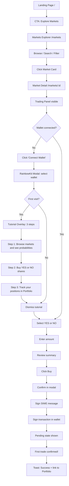
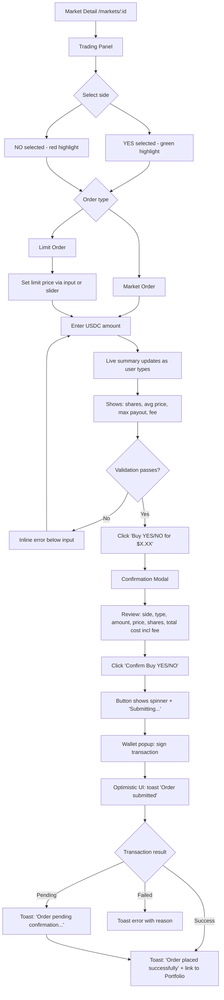
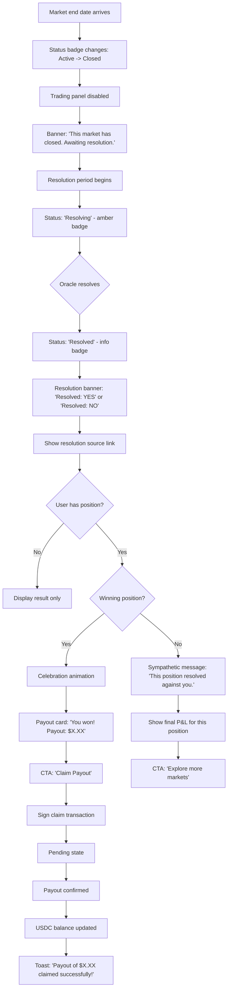
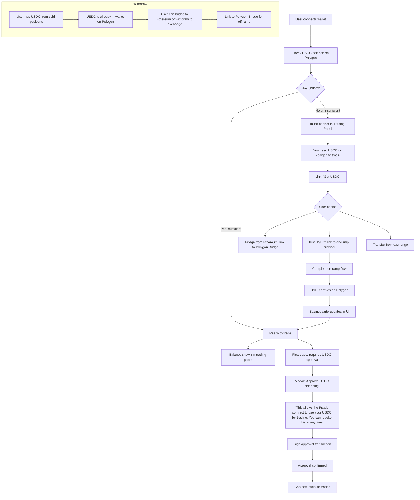

# Phase 1.4: UX Design

> Documento de trabajo | v1.0 | Abril 2026
> Plataforma: **Praxis** -- Prediction Markets

---

## Tabla de Contenidos

1. [User Flows Completos](#1-user-flows-completos)
2. [Interaction Specifications](#2-interaction-specifications)
3. [Responsive Layout Specifications](#3-responsive-layout-specifications)
4. [Accessibility Checklist](#4-accessibility-checklist)
5. [Micro-interactions](#5-micro-interactions)
6. [Component Behavior Specs](#6-component-behavior-specs)

---

## 1. User Flows Completos

### Flow 1: Onboarding (Nuevo Usuario)

**Objetivo:** Landing a primer trade en menos de 3 minutos.



**Puntos de friccion a eliminar:**

| Friccion | Solucion implementada |
|---|---|
| Usuario no sabe que es un prediction market | Tutorial overlay de 3 pasos en primer visita, con opcion de "Skip" |
| Conectar wallet es intimidante para no-crypto | RainbowKit con opciones claras (MetaMask, WalletConnect, Coinbase Wallet). Copy: "Connect your wallet to start trading" |
| No tiene USDC | Detectar balance cero post-conexion y mostrar inline banner: "You need USDC on Polygon to trade" con link a bridge/buy |
| No entiende YES/NO | Tooltip en los botones: "Buy YES if you think this will happen. Buy NO if you think it won't." |
| Miedo a la primera transaccion | Mostrar summary completo con fee breakdown antes de confirmar. Copy de confianza: "You can sell your position at any time." |

**Metricas:**

| Metrica | Target | Medicion |
|---|---|---|
| Time-to-first-trade (desde landing) | < 3 minutos | Timestamp landing load -> primer tx confirmada |
| Drop-off: Landing -> Markets | < 30% | Funnel analytics |
| Drop-off: Markets -> Market Detail | < 40% | Click-through rate en cards |
| Drop-off: Market Detail -> Connect Wallet | < 50% | CTA engagement |
| Drop-off: Connect Wallet -> First Trade | < 60% | Wallet connect -> tx submitted |
| Tutorial completion rate | > 70% | Steps viewed vs. dismissed early |

---

### Flow 2: Trading

**Happy Path:**



**Error Paths:**

```mermaid
flowchart TD
    A[User clicks Confirm] --> B{Check conditions}
    B --> C[Insufficient USDC balance]
    C --> C1[Toast: 'Insufficient USDC balance. You have $X.XX available.']
    C1 --> C2[Link: 'Get USDC']
    
    B --> D[Market closed/paused]
    D --> D1[Trading panel disabled]
    D1 --> D2[Banner: 'This market is closed for trading']
    
    B --> E[Transaction rejected by user]
    E --> E1[Toast: 'Transaction cancelled']
    E1 --> E2[Form state preserved - user can retry]
    
    B --> F[Transaction failed on-chain]
    F --> F1[Toast: 'Transaction failed: {reason}']
    F1 --> F2[Retry button in toast]
    
    B --> G[Network error]
    G --> G1[Toast: 'Network error. Please check your connection.']
    G1 --> G2[Retry button]
    
    B --> H[Price moved significantly]
    H --> H1[Modal: 'Price has changed since your order. New price: $X.XX. Continue?']
    H1 --> H2[Accept new price / Cancel]
```

**Optimistic UI Pattern:**

1. Usuario confirma orden -> inmediatamente mostrar toast "Order submitted" con spinner
2. Boton cambia a estado disabled con texto "Submitting..."
3. Si la tx se confirma on-chain: toast verde "Order placed successfully"
4. Si la tx falla: revertir el estado optimista, mostrar toast de error con razon especifica
5. En Portfolio: mostrar posicion con badge "Pending" hasta confirmacion on-chain

---

### Flow 3: Portfolio Management

```mermaid
flowchart TD
    A[Navigate to /portfolio] --> B{Wallet connected?}
    B -- No --> C[Empty state: 'Connect your wallet to view portfolio']
    C --> D[ConnectButton CTA]
    B -- Yes --> E[Load portfolio data]
    E --> F[Summary Cards: Total Value, Total P&L, Open Positions]
    F --> G[Tabs: Positions | Open Orders | Trade History]
    
    G --> H[Positions Tab]
    H --> I[Table: Market, Outcome, Shares, Avg Cost, Current, Value, P&L]
    I --> J{Evaluate position}
    J --> K[P&L positive: green text, + prefix]
    J --> L[P&L negative: red text, - prefix]
    
    J --> M{Decision}
    M --> N[Hold: no action]
    M --> O[Sell: click position row]
    O --> P[Navigate to /markets/:id]
    P --> Q[Trading panel pre-filled with sell data]
    Q --> R[Execute sell order]
    R --> S[Return to portfolio]
    S --> T[Updated P&L and balances]
    
    G --> U[Open Orders Tab]
    U --> V[Table with Cancel button per order]
    V --> W[Click Cancel -> confirmation -> cancel tx]
    
    G --> X[Trade History Tab]
    X --> Y[Chronological list of all executed trades]
```

**Comunicacion visual de P&L:**

| Estado | Color | Icono/Prefijo | Formato |
|---|---|---|---|
| P&L positivo | `text-profit` (#10B981) | `+` prefix | `+$42.50 (+12.3%)` |
| P&L negativo | `text-loss` (#EF4444) | `-` prefix (implicito) | `-$18.20 (-5.1%)` |
| P&L neutro | `text-white` | Sin prefijo | `$0.00 (0.0%)` |
| Posicion pendiente | `text-warm-gray` | Badge "Pending" | Valores en gris hasta confirmacion |

**Summary Cards - Comportamiento:**

- **Total Value:** Suma de (shares * current_price) para todas las posiciones. Font mono, blanco, 2xl.
- **Total P&L:** Suma de P&L de todas las posiciones. Color dinamico segun positivo/negativo. Font mono bold.
- **Open Positions:** Conteo simple. Font mono, blanco.

---

### Flow 4: Market Resolution



**Estados visuales de resolucion:**

| Estado | Badge | Panel | Banner |
|---|---|---|---|
| Active | `success` (green) | Trading enabled | None |
| Closed | `danger` (red) | Trading disabled, grayed out | "Market closed. Awaiting resolution." |
| Resolving | `warning` (amber) | Trading disabled | "Resolution in progress..." with spinner |
| Resolved YES | `info` (blue) | Hidden, replaced by result card | "Resolved: YES" with green checkmark |
| Resolved NO | `info` (blue) | Hidden, replaced by result card | "Resolved: NO" with red X |

**Celebration Moment (winning position):**

- Confetti animation (canvas-confetti) durante 3 segundos
- Payout card con borde gradient teal, fondo dark-surface
- Monto del payout en text-profit, font-mono, text-3xl
- Boton "Claim Payout" en variant primary (teal)
- Respeta `prefers-reduced-motion`: sin confetti, solo el card

---

### Flow 5: Deposit / Withdraw



**USDC Approval UX:**

- Primera vez que el usuario opera: modal explicativo antes de la aprobacion
- Copy claro: "This is a one-time approval to allow Praxis to interact with your USDC."
- Opcion: "Approve exact amount" vs "Approve unlimited" (con tooltip explicando trade-offs)
- Indicador de progreso: Step 1 of 2 (Approve) -> Step 2 of 2 (Trade)
- Despues de aprobar, el flujo continua automaticamente al trade

---

## 2. Interaction Specifications

### 2.1 Loading States

**Market List (`/markets`):**

```
+------------------------------------------+
|  [skeleton]  [skeleton]  [skeleton]       |
|  h:200px     h:200px     h:200px         |
|  rounded-xl  rounded-xl  rounded-xl      |
|                                           |
|  [skeleton]  [skeleton]  [skeleton]       |
|  h:200px     h:200px     h:200px         |
+------------------------------------------+
```

- Grid de 6 skeleton cards (3x2 en desktop, 2x3 en tablet, 6x1 en mobile)
- Componente: `<Skeleton variant="card" />`
- Animacion: pulse (opacity 0.4 -> 0.7 -> 0.4) con `animate-pulse`
- Duracion ciclo: 1.5s
- Color base: `bg-dark-surface` con shimmer `bg-dark-border/30`

**Market Detail (`/markets/:id`):**

```
+------------------------------------------+
|  [skeleton text w:60% h:32px]            |  <- Title
|  [skeleton text w:40% h:16px]            |  <- Metadata
|                                           |
|  +------------------------+ +---------+  |
|  | [skeleton rect]        | | [skel]  |  |
|  | h:400px                | | h:400px |  |
|  | Chart area             | | Panel   |  |
|  +------------------------+ +---------+  |
+------------------------------------------+
```

- Skeleton de titulo (60% ancho, 32px alto)
- Skeleton de metadata (40% ancho, 16px alto)
- Grid: 2/3 skeleton rect (chart) + 1/3 skeleton rect (panel), ambos h:400px
- Componentes: `<Skeleton variant="text" />` y `<Skeleton variant="rect" />`

**Portfolio (`/portfolio`):**

```
+------------------------------------------+
|  [skeleton] [skeleton] [skeleton]         |  <- 3 summary cards
|  h:100px    h:100px    h:100px           |
|                                           |
|  [skeleton rect h:40px w:300px]          |  <- Tab bar
|  [skeleton rect h:300px w:100%]          |  <- Table area
+------------------------------------------+
```

- 3 summary card skeletons en grid (sm:grid-cols-3)
- Tab bar skeleton
- Table skeleton con 5 rows de h:48px cada una

**Order Submission:**

| Estado | Boton | Feedback adicional |
|---|---|---|
| Idle | `Buy YES for $10.00` (enabled) | -- |
| Validating | `Buy YES for $10.00` (enabled) | Inline errors below inputs |
| Submitting | `<Spinner /> Submitting...` (disabled) | -- |
| Awaiting wallet | `<Spinner /> Awaiting signature...` (disabled) | Toast: "Please confirm in your wallet" |
| Confirmed | `Buy YES for $10.00` (reset) | Toast verde: "Order placed successfully" |
| Failed | `Buy YES for $10.00` (re-enabled) | Toast rojo con razon del error |

### 2.2 Error States

**Network Error:**

```
+------------------------------------------+
| [!] Connection lost. Retrying...  [Retry]|
+------------------------------------------+
```

- Banner sticky debajo del header
- Background: `bg-loss/10` con borde `border-loss/30`
- Icono de warning (amber) + texto + boton "Retry"
- Auto-retry cada 10 segundos con countdown visual
- Desaparece automaticamente cuando la conexion se restaura

**Market Not Found (`/markets/:id` con ID invalido):**

```
+------------------------------------------+
|                                           |
|        Market not found                   |
|   The market you are looking for does     |
|   not exist or has been removed.          |
|                                           |
|        [Back to Markets]                  |
|                                           |
+------------------------------------------+
```

- Centrado vertical y horizontal
- Titulo: `text-xl font-semibold text-warm-gray`
- Subtitulo: `text-sm text-warm-gray/70`
- Link a `/markets` como CTA secundario
- Ya implementado en `markets/[id]/page.tsx`

**Order Failed:**

Toast de error con informacion especifica:

| Error | Mensaje del toast | Accion |
|---|---|---|
| Insufficient balance | "Insufficient USDC balance. You have $X.XX available." | Link "Get USDC" |
| Market closed | "This market is no longer accepting orders." | Link back to markets |
| Transaction reverted | "Transaction failed: {revert reason}" | "Retry" button |
| User rejected tx | "Transaction cancelled by user." | Auto-dismiss 5s |
| Slippage too high | "Price moved beyond slippage tolerance." | "Retry with updated price" |
| Network congestion | "Network congestion detected. Try again shortly." | "Retry" button |

**Wallet Disconnected Mid-Action:**

```
+------------------------------------------+
|        [Modal - centered]                 |
|                                           |
|   Wallet Disconnected                     |
|                                           |
|   Your wallet was disconnected during     |
|   the transaction. Please reconnect       |
|   to continue.                            |
|                                           |
|   [Reconnect Wallet]    [Cancel]          |
|                                           |
+------------------------------------------+
```

- Modal con overlay `bg-black/60 backdrop-blur-sm`
- Boton primario: "Reconnect Wallet" (abre RainbowKit)
- Boton secundario: "Cancel" (cierra modal, preserva form state)

### 2.3 Empty States

**No Markets Match Filter (`/markets` con filtros activos):**

```
+------------------------------------------+
|                                           |
|        [Search icon, 16x16, gray]        |
|                                           |
|        No markets found                   |
|   Try adjusting your filters or           |
|   search query                            |
|                                           |
|        [Clear Filters]                    |
|                                           |
+------------------------------------------+
```

- Icono SVG de busqueda, `w-16 h-16 text-warm-gray/40`
- Titulo: `text-lg font-semibold text-warm-gray`
- Subtitulo: `text-sm text-warm-gray/70`
- Boton "Clear Filters" que resetea todos los filtros y search
- Ya implementado en `markets/page.tsx`

**No Positions (`/portfolio`, tab Positions):**

```
+------------------------------------------+
|                                           |
|        [Chart icon, 16x16, gray]         |
|                                           |
|        No open positions                  |
|   Start trading to see your positions     |
|   here.                                   |
|                                           |
|        [Explore Markets]                  |
|                                           |
+------------------------------------------+
```

- Misma estructura visual que otros empty states
- CTA: link a `/markets`
- Actualmente implementado como texto simple; mejorar con icono + CTA

**No Open Orders:**

- Texto centrado: "No open orders"
- Estilo: `text-sm text-warm-gray`, padding vertical 48px
- Ya implementado en `portfolio/page.tsx`

**No Trade History:**

- Texto centrado: "No trade history"
- Estilo: `text-sm text-warm-gray`, padding vertical 48px
- Ya implementado en `portfolio/page.tsx`

### 2.4 Success States

**Order Placed:**

```
+------------------------------------------+
|                           [toast slide-in]|
|                                           |
|   [check icon]  Order placed successfully |
|                 View in Portfolio ->       |
|   [progress bar diminishing over 5s]      |
|                                           |
+------------------------------------------+
```

- Toast verde (`bg-profit/10 border-profit/30`)
- Icono: checkmark circle en profit green
- Texto: "Order placed successfully"
- Link: "View in Portfolio" que navega a `/portfolio`
- Auto-dismiss: 5 segundos con barra de progreso visual
- Hover sobre el toast pausa el auto-dismiss

**Order Filled:**

- Toast verde: "Order filled at $0.65"
- Incluye: shares obtenidas y precio promedio
- Link a portfolio

**Market Resolved (ganador):**

- Confetti animation (3 segundos, `canvas-confetti`)
- Card especial con gradient border (teal)
- Monto del payout prominente en profit green
- Boton "Claim Payout"
- Respeta `prefers-reduced-motion`

---

## 3. Responsive Layout Specifications

### 3.1 Desktop (> 1024px)

**Header (`<Header />`):**

```
+------------------------------------------------------------------+
| [P] Praxis  |  Markets  Portfolio  | [Search input w:md] | [Wallet] |
+------------------------------------------------------------------+
```

- Logo con icono "P" (teal square, 32x32) + texto "Praxis"
- Nav links inline con highlight activo (`bg-dark-surface`)
- Search bar: `max-w-md`, siempre visible
- Wallet button (RainbowKit): muestra avatar + address truncado
- Altura: h-16 (64px)
- Sticky top-0 con backdrop-blur

**Market Detail:**

```
+------------------------------------------------------------------+
| [Badge: Active] [Badge: Category]                                |
| Market Question Title (text-3xl)                                 |
| Ends Jan 20, 2027  |  Vol. $1.2M  |  2,400 traders             |
|                                                                   |
| +--------------------------------------+ +-------------------+   |
| | Price Chart (PriceChart)             | | Trading Panel      |   |
| | h: auto, min-h: 300px               | | sticky top-24      |   |
| +--------------------------------------+ | rounded-xl         |   |
|                                          | border dark-border |   |
| +------------------+ +----------------+ |                     |   |
| | Order Book       | | Recent Trades  | |                     |   |
| | md:col-span-1    | | md:col-span-1  | |                     |   |
| +------------------+ +----------------+ +-------------------+   |
|                                                                   |
| +--------------------------------------+                         |
| | About this market                    |                         |
| | Resolution source, Rules             |                         |
| +--------------------------------------+                         |
+------------------------------------------------------------------+
```

- Grid: `grid-cols-3`, left area `col-span-2`
- Trading panel: `lg:sticky lg:top-24` (ya implementado)
- Order book + trades: `grid-cols-2` dentro del area izquierda

**Portfolio:**

```
+------------------------------------------------------------------+
| Portfolio (text-3xl)                                             |
|                                                                   |
| [Total Value]    [Total P&L]    [Open Positions]                 |
| $1,234.56        +$142.50       5                                |
|                                                                   |
| +--------------------------------------------------------------+ |
| | [Positions] [Open Orders] [Trade History]    <- tabs          | |
| |                                                                | |
| | Market | Outcome | Shares | Avg Cost | Current | Value | P&L | |
| | ...    | YES     | 100    | $0.45    | $0.62   | $62   | +$17| |
| | ...    | NO      | 50     | $0.30    | $0.25   | $12.5 | -$2 | |
| +--------------------------------------------------------------+ |
+------------------------------------------------------------------+
```

- Summary cards: `grid-cols-3`
- Tabla: full-width con scroll horizontal si es necesario
- Columnas con alignment: texto a la izquierda, numeros a la derecha

### 3.2 Tablet (768px - 1024px)

**Header:**

- Mismo layout que desktop
- Search bar puede ser mas angosto (`max-w-sm`)
- Nav links se mantienen visibles

**Market Detail:**

```
+------------------------------------------+
| [Badge] [Badge]                          |
| Market Question (text-2xl)               |
| Metadata                                 |
|                                           |
| +--------------------------------------+ |
| | Price Chart (full width)             | |
| +--------------------------------------+ |
|                                           |
| +--------------------------------------+ |
| | Trading Panel (full width)           | |
| +--------------------------------------+ |
|                                           |
| +------------------+ +----------------+ |
| | Order Book       | | Recent Trades  | |
| +------------------+ +----------------+ |
|                                           |
| +--------------------------------------+ |
| | About this market                    | |
| +--------------------------------------+ |
+------------------------------------------+
```

- Todo stacked verticalmente: chart -> panel -> orderbook/trades -> about
- Trading panel pierde el sticky, se muestra inline
- Order book y trades mantienen side-by-side en `md:grid-cols-2`

**Markets Explorer:**

- Sidebar de filtros colapsa a bottom sheet (ya implementado con `mobileFiltersOpen`)
- Grid de cards: `sm:grid-cols-2`
- Chips de categoria: scroll horizontal (ya implementado)

**Portfolio:**

- Summary cards: `sm:grid-cols-3` (se mantiene)
- Tablas: scroll horizontal habilitado con `overflow-x-auto` (ya implementado)

### 3.3 Mobile (< 768px)

**Header:**

```
+------------------------------------------+
| [P]              [Search icon] [Wallet] [Hamburger] |
+------------------------------------------+
| [Search bar expanded - if search open]   |
+------------------------------------------+
| [Markets]                                |  <- mobile menu
| [Portfolio]                              |  <- if hamburger open
+------------------------------------------+
```

- Logo: solo icono "P", sin texto "Praxis" (ya implementado con `hidden sm:inline`)
- Nav links: ocultos, accesibles via hamburger menu
- Search: icono que expande a full-width input (ya implementado)
- Wallet: muestra solo avatar en pantalla pequena (ya configurado con `accountStatus`)
- Mobile menu: slide-down con links en column

**Market Detail:**

```
+------------------------------------------+
| [Badge] [Badge]                          |
| Market Question (text-2xl)               |
| Metadata                                 |
|                                           |
| +--------------------------------------+ |
| | Price Chart (full width, touch)      | |
| | Swipe to pan, pinch to zoom          | |
| +--------------------------------------+ |
|                                           |
| +--------------------------------------+ |
| | Order Book (full width)              | |
| +--------------------------------------+ |
|                                           |
| +--------------------------------------+ |
| | Recent Trades (full width)           | |
| +--------------------------------------+ |
|                                           |
| +--------------------------------------+ |
| | About this market                    | |
| +--------------------------------------+ |
|                                           |
| +--------------------------------------+ |
| | [STICKY BOTTOM SHEET]               | |
| | Trading Panel                        | |
| | Expandable: tap to open full panel   | |
| +--------------------------------------+ |
+------------------------------------------+
```

- Trading panel: sticky bottom sheet
  - Estado colapsado: muestra YES/NO price + "Trade" button (h: 64px)
  - Estado expandido: full trading panel, slide up con max-h: 70vh
  - Overlay backdrop cuando expandido
  - Gesto: swipe down para colapsar
- Chart: touch-optimized (swipe to pan, pinch to zoom)
- Order book y trades: full width, stacked
- Todo el contenido tiene padding-bottom extra (80px) para no quedar detras del bottom sheet

**Markets Explorer:**

```
+------------------------------------------+
| Markets (text-2xl)                       |
| [Search full width]  [Filter icon]       |
|                                           |
| [Category chips - horizontal scroll]     |
|                                           |
| +--------------------------------------+ |
| | Market Card (full width)             | |
| +--------------------------------------+ |
| +--------------------------------------+ |
| | Market Card (full width)             | |
| +--------------------------------------+ |
| +--------------------------------------+ |
| | Market Card (full width)             | |
| +--------------------------------------+ |
+------------------------------------------+
```

- Cards: single column (`grid-cols-1`)
- Filter: icono que abre bottom sheet con filtros (ya implementado)
- Search: full-width en su row

**Portfolio:**

```
+------------------------------------------+
| Portfolio (text-2xl)                     |
|                                           |
| [Total Value] [Total P&L] [Positions]   |
|  (stacked if sm fails)                   |
|                                           |
| [Positions] [Orders] [History] <- tabs   |
|                                           |
| +--------------------------------------+ |
| | Position Card View                   | |
| | Market: Will X happen?               | |
| | Outcome: YES    Shares: 100          | |
| | Value: $62.00   P&L: +$17.00        | |
| +--------------------------------------+ |
| +--------------------------------------+ |
| | Position Card View                   | |
| +--------------------------------------+ |
+------------------------------------------+
```

- Summary cards: pueden ir a `grid-cols-1` en pantallas muy pequenas (< 400px) o mantener `grid-cols-3` comprimido
- Tablas: dos opciones (implementar la que mejor pruebe en user testing):
  - **Opcion A:** Horizontal scroll con `overflow-x-auto` (actual)
  - **Opcion B:** Card view donde cada row se convierte en un card apilado
- Recomendacion: Card view para mobile, tabla con scroll para tablet

**Breakpoints de referencia (Tailwind defaults):**

| Breakpoint | Tamano | Uso |
|---|---|---|
| `sm` | >= 640px | 2-column cards, show logo text |
| `md` | >= 768px | Desktop nav, side-by-side orderbook/trades |
| `lg` | >= 1024px | 3-column market detail, sidebar filters |
| `xl` | >= 1280px | 3-column market cards grid |

---

## 4. Accessibility Checklist

### 4.1 Color Contrast (WCAG AA)

| Combinacion | Foreground | Background | Ratio | Cumple AA? |
|---|---|---|---|---|
| Body text on dark bg | `#FAFBFC` (white) | `#0B1120` (dark-bg) | 17.4:1 | Si |
| Secondary text on dark bg | `#6B7B8D` (warm-gray) | `#0B1120` (dark-bg) | 4.8:1 | Si |
| Teal on dark bg | `#00D4AA` (teal) | `#0B1120` (dark-bg) | 9.2:1 | Si |
| Profit green on dark bg | `#10B981` (profit) | `#0B1120` (dark-bg) | 7.1:1 | Si |
| Loss red on dark bg | `#EF4444` (loss) | `#0B1120` (dark-bg) | 4.6:1 | Si |
| Teal text on navy button | `#0A1628` (navy) | `#00D4AA` (teal) | 9.5:1 | Si |
| Warm-gray on dark-surface | `#6B7B8D` (warm-gray) | `#151E2F` (dark-surface) | 3.8:1 | Si (large text) |
| Warning amber on dark bg | `#F59E0B` (amber) | `#0B1120` (dark-bg) | 8.5:1 | Si |

> NOTA: La combinacion warm-gray sobre dark-surface (3.8:1) cumple AA solo para texto grande (>= 18pt o >= 14pt bold). Para texto pequeno en labels/captions, considerar usar un gris mas claro (`#8B9DB5`, ~5.2:1) o asegurar que el texto sea >= 14px semibold.

**Regla general:** Todo texto funcional debe cumplir 4.5:1 minimo. Texto decorativo y placeholders pueden tener menor contraste, pero labels y datos financieros deben ser legibles.

### 4.2 Keyboard Navigation

**Flujo de tabulacion por pagina:**

**Landing (`/`):**
1. Skip to content link (hidden, visible on focus)
2. Header: Logo -> Markets -> Portfolio -> Search input -> Wallet button
3. Hero: "Explore Markets" CTA
4. Categories: cada chip de categoria (scroll horizontal con arrow keys)
5. Market cards: cada card es focusable, Enter para navegar

**Markets (`/markets`):**
1. Skip to content
2. Header
3. Search input (auto-focus sugerido)
4. Filter toggle (mobile)
5. Sidebar filters: cada radio/checkbox group navegable con arrow keys
6. Market cards en grid: Tab entre cards, Enter para navegar

**Market Detail (`/markets/:id`):**
1. Skip to content
2. Header
3. Trading panel: YES/NO toggle -> Market/Limit tabs -> Amount input -> (Limit price if limit) -> Buy button
4. Chart: focusable, arrow keys para moverse entre data points
5. Order book: rows focusables
6. Trade history

**Portfolio (`/portfolio`):**
1. Skip to content
2. Header
3. Tab bar: arrow keys entre tabs
4. Table rows: Tab entre filas, Enter para accion contextual
5. Cancel button en Open Orders: focusable, Enter/Space para activar

### 4.3 Screen Reader Labels

| Elemento | `aria-label` / `aria-labelledby` |
|---|---|
| Logo link | `aria-label="Praxis home"` |
| Search input | `aria-label="Search markets"` |
| Hamburger button | `aria-label="Menu"` (ya implementado) |
| Mobile search toggle | `aria-label="Search"` (ya implementado) |
| Filter toggle (mobile) | `aria-label="Toggle filters"` (ya implementado) |
| YES/NO toggle buttons | `aria-pressed="true/false"` + `aria-label="Buy Yes shares"` |
| Market/Limit tabs | `role="tablist"` con `role="tab"` y `aria-selected` |
| Amount input | `aria-label="Amount in USDC"` con `aria-describedby` apuntando a error |
| Limit price slider | `aria-label="Limit price"` + `aria-valuemin/max/now` |
| MAX button | `aria-label="Set maximum amount"` |
| Summary section | `aria-live="polite"` para anunciar cambios en calculo |
| Toast notifications | `role="alert"` + `aria-live="assertive"` |
| Modal | `role="dialog"` + `aria-modal="true"` + `aria-labelledby` (ya en `<Modal />`) |
| P&L values | `aria-label="Profit and loss: positive $42.50, up 12.3 percent"` |
| Skeleton loaders | `aria-busy="true"` + `aria-label="Loading"` en el contenedor |
| Portfolio tabs | `role="tablist"` (ya implementado via `<Tabs />`) |
| Table sort headers | `aria-sort="ascending/descending/none"` |
| Badge components | `role="status"` para badges de estado de mercado |

### 4.4 Focus Indicators

- **Default:** Outline de 2px en `teal` (#00D4AA) con offset de 2px
- **Implementacion:** `focus-visible:outline-2 focus-visible:outline-offset-2 focus-visible:outline-teal`
- **Botones:** outline + ligero aumento de brillo del fondo
- **Inputs:** border cambia a `border-teal` (ya implementado en `<Input />`)
- **Cards:** outline + subtle shadow teal
- **Links:** underline + outline
- **No usar** `outline: none` sin reemplazo visual

### 4.5 Motion Reduced Mode

```css
@media (prefers-reduced-motion: reduce) {
  /* Desactivar todas las animaciones */
  *, *::before, *::after {
    animation-duration: 0.01ms !important;
    animation-iteration-count: 1 !important;
    transition-duration: 0.01ms !important;
  }

  /* Skeleton: color solido sin pulse */
  .animate-pulse {
    animation: none;
    opacity: 0.5;
  }

  /* Toasts: aparecen sin slide */
  /* Confetti: no se dispara */
  /* Price flash: no flash, solo color change */
  /* Tab underline: snap en lugar de slide */
}
```

**Elementos afectados:**

| Animacion | Comportamiento normal | Con reduced-motion |
|---|---|---|
| Skeleton pulse | Opacity cycles 1.5s | Opacity fija 0.5 |
| Toast slide-in | Slide from right 300ms | Aparece instantaneamente |
| Confetti (resolution) | 3s de particulas | No se muestra |
| Price flash (green/red) | 1s fade | Color change instantaneo, sin fade |
| Probability bar fill | 600ms ease-out | Llenado instantaneo |
| Tab underline slide | 200ms transition | Snap instantaneo |
| Market card hover | Shadow + border transition | Solo cambio de color instantaneo |
| Mobile menu | Slide-down 150ms | Aparece instantaneamente |
| Bottom sheet | Slide-up 200ms | Aparece instantaneamente |

---

## 5. Micro-interactions

### 5.1 Market Card Hover

```
Estado idle:
  border: 1px solid dark-border (#1E293B)
  shadow: none
  transform: none

Estado hover:
  border: 1px solid warm-gray/30
  shadow: 0 0 20px rgba(0, 212, 170, 0.05)  /* teal glow muy sutil */
  transform: translateY(-1px)
  transition: all 200ms ease-out

Estado focus-visible:
  outline: 2px solid teal, offset 2px
  (mismos estilos que hover para border/shadow)

Estado active (click):
  transform: translateY(0)
  transition: transform 100ms
```

### 5.2 Probability Bars

```
Al cargar el market card:
  width: 0% -> {probability}%
  transition: width 600ms ease-out
  delay: index * 50ms (stagger entre cards)

Color:
  YES bar: bg-profit (#10B981) con opacity 0.2 de fondo, opacity 1.0 de fill
  NO bar: bg-loss (#EF4444) con opacity 0.2 de fondo, opacity 1.0 de fill

Actualizacion en vivo:
  width transition: 300ms ease-in-out (cuando cambia la probabilidad)
```

### 5.3 Price Change Flash

```
Cuando un precio cambia en tiempo real (WebSocket update):

Si precio sube:
  1. Texto cambia a text-profit (#10B981)
  2. Background flash: bg-profit/10 (rgba(16, 185, 129, 0.1))
  3. Duration: 1000ms
  4. Fade out: opacity 1 -> 0 sobre los ultimos 500ms
  5. Retorna a color original

Si precio baja:
  1. Texto cambia a text-loss (#EF4444)
  2. Background flash: bg-loss/10
  3. Misma duracion y fade

Implementacion CSS:
  .price-flash-up {
    animation: flash-green 1s ease-out;
  }
  @keyframes flash-green {
    0% { background-color: rgba(16, 185, 129, 0.15); color: #10B981; }
    50% { background-color: rgba(16, 185, 129, 0.08); color: #10B981; }
    100% { background-color: transparent; color: inherit; }
  }
```

### 5.4 Order Book Level Updates

```
Nuevo nivel aparece:
  opacity: 0 -> 1
  transition: opacity 300ms ease-in
  
Nivel removido:
  opacity: 1 -> 0
  transition: opacity 200ms ease-out
  Luego se remueve del DOM

Nivel con cambio de cantidad:
  Depth bar width transition: 200ms ease-in-out
  Si cantidad aumenta: brief teal highlight (200ms)
  Si cantidad disminuye: brief amber highlight (200ms)
```

### 5.5 Toast Notifications

```
Entrada:
  transform: translateX(100%) -> translateX(0)
  opacity: 0 -> 1
  transition: 300ms cubic-bezier(0.16, 1, 0.3, 1)

Posicion: fixed, top-4 right-4 (o bottom-4 right-4 en mobile)
Stacking: nuevos toasts se apilan arriba, con gap de 8px

Auto-dismiss:
  Progress bar en la parte inferior del toast
  width: 100% -> 0% sobre {duration} (default 5s)
  Color: teal (success), loss (error), amber (warning)
  
  Hover sobre toast:
    Progress bar se pausa
    Opacity del progress bar: 0.5 -> 1

Salida:
  transform: translateX(0) -> translateX(110%)
  opacity: 1 -> 0
  transition: 200ms ease-in

Dismiss manual:
  Click en X o swipe right (mobile)
```

### 5.6 Tab Switch (Trading Panel & Portfolio)

```
Underline indicator:
  position: absolute, bottom: 0
  height: 2px
  background: teal (#00D4AA)
  border-radius: 1px (top corners)
  
  Cuando el usuario cambia de tab:
    left: {prev tab left} -> {new tab left}
    width: {prev tab width} -> {new tab width}
    transition: left 200ms ease-out, width 200ms ease-out

Tab label:
  Color inactivo: text-warm-gray
  Color activo: text-teal (trading panel) o text-white (portfolio)
  transition: color 150ms
```

### 5.7 Side Toggle (YES/NO)

```
Estado activo YES:
  background: bg-profit (#10B981)
  color: text-white
  transition: background-color 150ms, color 150ms

Estado activo NO:
  background: bg-loss (#EF4444)
  color: text-white

Estado inactivo:
  background: transparent
  color: text-warm-gray

Switch animation:
  El fondo coloreado se "desliza" de un lado al otro
  Implementacion: transition en background-color del boton activo
```

### 5.8 Amount Input - Live Calculation

```
Mientras el usuario escribe en el amount input:

1. Summary section debajo se actualiza en cada keystroke
2. Numeros cambian con transition: opacity 150ms
3. Si hay error de validacion:
   - Error text slides down con height: 0 -> auto, opacity: 0 -> 1
   - Input border cambia a border-loss
   - transition: 200ms ease-out
4. Si el error se corrige:
   - Error text slides up y desaparece
   - Input border vuelve a normal
```

---

## 6. Component Behavior Specs

### 6.1 Trading Panel (`<TradingPanel />`)

**Estado actual de implementacion:** Funcional con side toggle, order type tabs, amount input, limit price slider, summary section, validacion, y confirmation modal. Usa mock data para la submission.

**Amount Input:**

| Comportamiento | Especificacion |
|---|---|
| Tipo | `type="number"`, sin spinners nativos (ocultos via CSS) |
| Placeholder | `"0.00"` |
| Prefix | `$` en teal |
| Suffix | Boton "MAX" que llena con el balance maximo del usuario |
| Debounce | Sin debounce -- actualizacion inmediata del summary |
| Formato | 2 decimales para USDC |
| Min value | > 0 (validacion inline) |
| Max value | Balance del usuario (validacion inline con mensaje especifico) |
| Error display | Texto rojo debajo del input, slide-in animation |

**Live Cost Calculation (Summary Section):**

Visible solo cuando `amount > 0`. Muestra:

| Campo | Calculo | Formato |
|---|---|---|
| Shares | `amount / effectivePrice` | `X.XX` con separador de miles |
| Avg Price | `effectivePrice` (market o limit) | `$X.XXXX` (4 decimales) |
| Max Payout | `shares * 1.00` (pago si resuelve a favor) | `$X.XX` en profit green |
| Fee (0.5%) | `amount * 0.005` | `$X.XX` |
| Total Cost | `amount + fee` (en modal de confirmacion) | `$X.XX` bold |

**Price Slider (Limit Orders):**

| Propiedad | Valor |
|---|---|
| Range | 0.01 - 0.99 |
| Step | 0.01 |
| Default | 0.50 |
| Sync | Input numerico y slider estan sincronizados bidireccionalmente |
| Style | Accent color teal, track en dark-border |
| Labels | `$0.01` (izquierda) y `$0.99` (derecha) |
| Snap | Cada 0.01, sin valores intermedios |
| Feedback | El summary se actualiza al mover el slider |

**MAX Button:**

| Comportamiento | Especificacion |
|---|---|
| Click | Llena el input con el balance USDC disponible del usuario |
| Estado actual | Hardcoded a "100" (mock); implementar con balance real |
| Visual | Text teal, 10px, font-semibold |
| Accesibilidad | `aria-label="Set maximum amount"` |
| Edge case | Si balance es 0, el boton se deshabilita y muestra tooltip "No USDC available" |

**Validacion (Real-time, Inline):**

| Condicion | Mensaje | Cuando se muestra |
|---|---|---|
| Amount vacio | Sin error (boton disabled) | Siempre |
| Amount <= 0 | "Amount must be greater than 0" | Al escribir |
| Amount > balance | "Insufficient balance. You have $X.XX" | Al escribir |
| Limit price < 0.01 | "Price must be between 0.01 and 0.99" | Al cambiar precio |
| Limit price > 0.99 | "Price must be between 0.01 and 0.99" | Al cambiar precio |
| Market closed | Panel completo disabled, banner informativo | Al cargar |

**Confirmation Modal:**

| Campo | Valor mostrado |
|---|---|
| Market question | Texto completo de la pregunta |
| Side | "YES" (green) o "NO" (red) |
| Type | "Market" o "Limit" |
| Amount | `$X.XX` |
| Price | `$X.XXXX` |
| Shares | `X.XX` |
| Fee | `$X.XX` |
| **Total Cost** | `$X.XX` (amount + fee, bold, separado por border-top) |
| Botones | "Cancel" (ghost) + "Confirm Buy YES/NO" (primary/danger) |

### 6.2 Order Book (`<OrderBook />`)

**Click Interaction:**

| Accion | Resultado |
|---|---|
| Click en precio de ask (sell side) | Llena el input de limit price en Trading Panel con ese precio |
| Click en precio de bid (buy side) | Llena el input de limit price en Trading Panel con ese precio |
| Click cambia automaticamente a Limit order | Si estaba en Market, switch a Limit tab |

**Depth Bars:**

```
Cada nivel del order book muestra una barra de profundidad:

  Bar width = (level_quantity / max_quantity_in_book) * 100%
  
  Asks (sell): bg-loss/10, alineadas a la derecha
  Bids (buy): bg-profit/10, alineadas a la izquierda
  
  transition: width 200ms ease-in-out
```

**Mid-Price:**

```
+-------------------------------+
|  ASKS (sells) - red           |
|  $0.68  |  150  |  ████████  |
|  $0.67  |  300  |  ████████████ |
|  $0.66  |  500  |  ████████████████ |
+-------------------------------+
|  Mid: $0.655  Spread: $0.01 (1.5%)  |  <- prominente
+-------------------------------+
|  BIDS (buys) - green          |
|  $0.65  |  400  |  ██████████████ |
|  $0.64  |  250  |  ██████████ |
|  $0.63  |  100  |  ██████    |
+-------------------------------+
```

- Mid-price: promedio entre mejor bid y mejor ask
- Formato: `$X.XXX` en texto blanco bold
- Spread: mostrado como valor absoluto (`$0.01`) y porcentaje (`1.5%`)
- Color del spread: warm-gray si es normal, warning amber si es alto (> 5%)

**Agrupacion:**

- Default: mostrar top 8 niveles de cada lado (16 total)
- Overflow: scroll vertical dentro del componente
- Header: "Order Book" con selector de agrupacion (0.01, 0.05, 0.10) para mercados profundos

### 6.3 Price Chart (`<PriceChart />`)

**Configuracion Default:**

| Propiedad | Valor |
|---|---|
| Tipo | Line chart |
| Periodo default | 24H |
| Color linea | Teal (#00D4AA) |
| Area fill | Teal con gradient a transparente (opacity 0.1 -> 0) |
| Grid | Horizontal lines en dark-border/30 |
| Axis Y | Precios (0.00 - 1.00) |
| Axis X | Timestamps |

**Timeframe Selector:**

```
[1H] [4H] [1D] [1W] [1M] [ALL]
```

| Timeframe | Granularidad de datos | Formato eje X |
|---|---|---|
| 1H | 1 minuto | HH:MM |
| 4H | 5 minutos | HH:MM |
| 1D | 15 minutos | HH:MM |
| 1W | 1 hora | Mon HH:MM |
| 1M | 4 horas | Mon DD |
| ALL | 1 dia | Mon DD |

- Boton activo: `text-teal` con underline
- Boton inactivo: `text-warm-gray`
- Al cambiar timeframe: chart hace fade-out (100ms) -> carga nuevos datos -> fade-in (200ms)

**Hover / Crosshair:**

```
Al hacer hover sobre el chart:

1. Linea vertical (crosshair) sigue el cursor
   - Color: warm-gray/50
   - Estilo: dashed, 1px

2. Tooltip flotante:
   +---------------------------+
   | Price: $0.67              |
   | Time: Apr 12, 14:30      |
   | Change: +$0.03 (+4.7%)   |
   +---------------------------+
   
   - Background: dark-surface
   - Border: dark-border
   - Shadow: sm
   - Position: above the crosshair point, flip si no cabe

3. Dot en la linea del chart:
   - w:8 h:8 rounded-full
   - bg-teal con border white 2px

4. Linea horizontal (opcional):
   - Conecta el dot con el eje Y
   - Color: warm-gray/30, dashed
```

**Mobile Touch:**

| Gesto | Accion |
|---|---|
| Tap | Muestra crosshair + tooltip en el punto mas cercano |
| Long press | Mantiene crosshair visible, mover dedo para recorrer |
| Swipe horizontal | Pan (desplazar en el tiempo) |
| Pinch | Zoom in/out (cambiar granularidad visible) |
| Tap fuera del chart | Ocultar crosshair |

**Datos de referencia en el chart:**

- Linea punteada horizontal en $0.50 (even odds) con label "50%"
- Si hay posicion del usuario: linea punteada horizontal en el avg cost con label "Your avg: $X.XX"

---

## Anexo: Inventario de Componentes UI Existentes

La siguiente tabla resume los componentes ya implementados y su estado respecto a estas especificaciones:

| Componente | Path | Estado | Mejoras pendientes |
|---|---|---|---|
| `Header` | `components/layout/header.tsx` | Implementado | Agregar skip-to-content link, aria labels |
| `Sidebar` | `components/layout/sidebar.tsx` | Implementado | Keyboard navigation en filtros |
| `MarketCard` | `components/market/market-card.tsx` | Implementado | Hover micro-interaction, probability bar animation |
| `TradingPanel` | `components/market/trading-panel.tsx` | Implementado | MAX con balance real, optimistic UI, aria labels |
| `OrderBook` | `components/market/order-book.tsx` | Implementado | Click-to-fill, mid-price display, depth bars |
| `PriceChart` | `components/market/price-chart.tsx` | Implementado | Timeframe selector, crosshair, mobile touch |
| `TradeHistory` | `components/market/trade-history.tsx` | Implementado | Real-time updates via WebSocket |
| `Button` | `components/ui/button.tsx` | Implementado | Focus-visible styles |
| `Input` | `components/ui/input.tsx` | Implementado | aria-describedby para errors |
| `Modal` | `components/ui/modal.tsx` | Implementado | Focus trap, escape to close |
| `Skeleton` | `components/ui/skeleton.tsx` | Implementado | aria-busy, reduced motion |
| `Badge` | `components/ui/badge.tsx` | Implementado | role="status" para market status |
| `Tabs` | `components/ui/tabs.tsx` | Implementado | Sliding underline animation, arrow key nav |
| `Toast` | `components/ui/toast.tsx` | Implementado | Progress bar, role="alert" |
| `Card` | `components/ui/card.tsx` | Implementado | -- |
| `Spinner` | `components/ui/spinner.tsx` | Implementado | -- |

---

*Documento preparado como parte de Phase 1 -- Design & UX.*
*Documento anterior: Phase 1.3 -- Component Library.*
*Proximo documento: Phase 1.5 -- API Design.*
