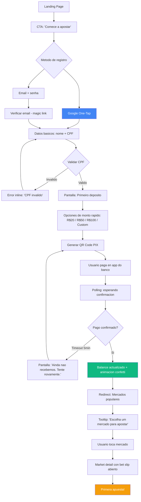
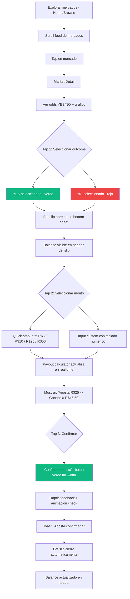
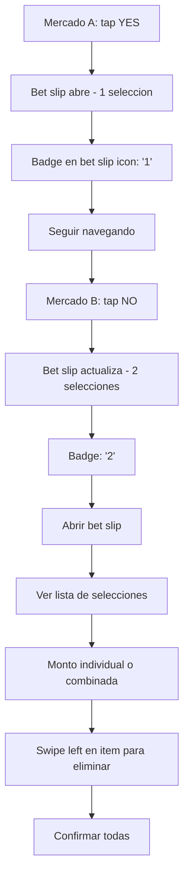
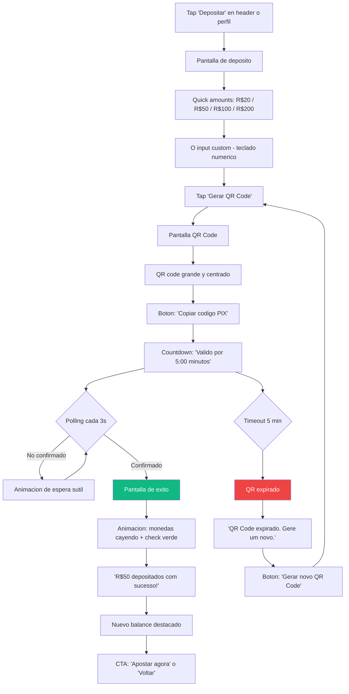
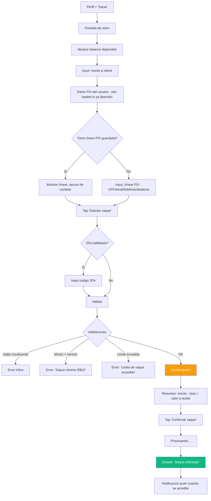
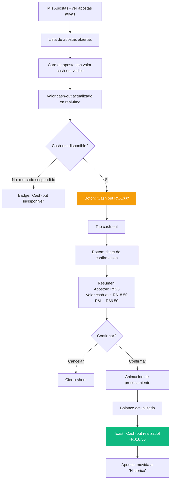
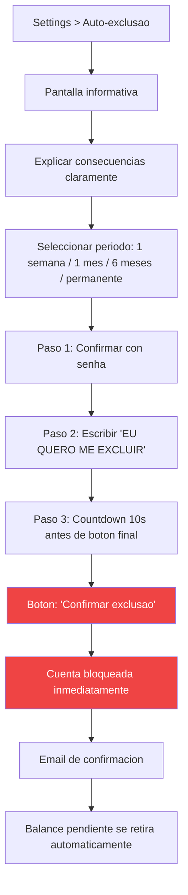

# Phase 2: UX Design -- Pivot a Fixed-Odds Betting

> Documento de trabajo | v1.0 | Abril 2026
> Plataforma: **Forka** -- Fixed-Odds Prediction Markets
> Audiencia: Brasil, perfil gaming/betting, mobile-first, NO crypto-native

---

## Tabla de Contenidos

1. [Flujos Principales](#1-flujos-principales)
2. [Bet Slip -- UX Critico](#2-bet-slip--ux-critico)
3. [Responsible Gambling](#3-responsible-gambling)
4. [Patterns de Referencia](#4-patterns-de-referencia)
5. [Mobile-First](#5-mobile-first)
6. [Dark Mode](#6-dark-mode)
7. [Animaciones y Micro-interacciones](#7-animaciones-y-micro-interacciones)
8. [Component Specs](#8-component-specs)

---

## Cambios Fundamentales vs UX Anterior

| Aspecto | Antes (Exchange) | Ahora (Betting) |
|---|---|---|
| Mental model | "Comprar shares YES/NO" | "Apostar en un resultado" |
| Entrada de dinero | Connect wallet + USDC | PIX (instant) |
| Panel de accion | Trading panel (limit/market orders) | Bet slip (monto + confirmar) |
| Vocabulario | Shares, price, order book | Apuesta, odds, payout |
| Complejidad | Alta (order types, slippage) | Baja (3 taps) |
| Onboarding | Wallet connect | Email/CPF/PIX |
| Layout del panel | Sidebar derecha siempre visible | Bottom sheet (mobile) / sidebar (desktop) |
| Moneda | USDC | BRL (via PIX) -> USDC internamente |

---

## 1. Flujos Principales

### Flow 1: Onboarding (Nuevo Usuario)

**Objetivo:** Registro a primera apuesta en menos de 2 minutos.



**Fricciones eliminadas vs modelo anterior:**

| Friccion anterior | Solucion betting |
|---|---|
| Conectar wallet (MetaMask, seed phrase) | Google One-Tap o email. Zero crypto. |
| Comprar USDC, bridge a Polygon | PIX: escanear QR, 5 segundos, listo |
| Aprobar USDC spending (tx en wallet) | No existe. Balance interno. |
| Entender order book, limit vs market | Solo: "quanto voce quer apostar?" |
| Firmar transaccion on-chain | No existe. Todo es off-chain para el usuario. |

**Metricas de onboarding:**

| Metrica | Target | Medicion |
|---|---|---|
| Registro completado (con CPF) | < 60s | Timestamp CTA click -> CPF validado |
| Primer deposito PIX | < 90s | CPF validado -> deposito confirmado |
| Primera apuesta | < 30s post-deposito | Deposito -> bet confirmed |
| Funnel completo (landing -> 1ra apuesta) | < 3 min | End-to-end |
| Drop-off registro -> deposito | < 25% | Funnel analytics |
| Drop-off deposito -> apuesta | < 15% | Funnel analytics |

---

### Flow 2: Apostar

**Happy Path (3 taps):**



**Flujo con multiples apuestas (carrito):**



**Error Paths:**

| Error | UX | Copy (PT-BR) |
|---|---|---|
| Saldo insuficiente | Input se pone rojo, boton disabled | "Saldo insuficiente. Deposite mais R$X" con link |
| Mercado cerrado | Odds grayed out, no tappable | "Este mercado esta encerrado" |
| Odds cambiaron | Modal de confirmacion | "As odds mudaram de 1.85 para 1.72. Aceitar?" |
| Error de red | Toast con retry | "Erro de conexao. Tente novamente." |
| Limite diario alcanzado | Modal informativo | "Voce atingiu seu limite diario de R$X" |
| Monto menor al minimo | Inline error | "Aposta minima: R$1" |

---

### Flow 3: Deposito PIX



**Pantalla QR Code -- Layout Mobile:**

```
+------------------------------------------+
|  < Voltar           Depositar    [?]     |
+------------------------------------------+
|                                          |
|         Depositando R$ 50,00             |
|                                          |
|     +----------------------------+       |
|     |                            |       |
|     |      [QR CODE - 240x240]   |       |
|     |                            |       |
|     +----------------------------+       |
|                                          |
|     Valido por  04:32                    |
|     ████████████████░░░░  (progress bar) |
|                                          |
|     +----------------------------+       |
|     | 📋  Copiar codigo PIX      |       |
|     +----------------------------+       |
|                                          |
|     Aguardando pagamento...              |
|     (pulsing dot animation)              |
|                                          |
+------------------------------------------+
```

---

### Flow 4: Retiro



**Tiempos de retiro y comunicacion:**

| Situacion | Tiempo estimado | Copy |
|---|---|---|
| Retiro automatico (< R$500) | Hasta 1 hora | "Seu saque sera processado em ate 1 hora" |
| Retiro manual (> R$500) | Hasta 24 horas | "Saque em analise. Prazo: ate 24 horas uteis" |
| Primer retiro | Requiere verificacion | "Primeiro saque requer verificacao de identidade" |

---

### Flow 5: Cash-Out (vender apuesta activa)



**Cash-out: comunicacion de P&L:**

```
+------------------------------------------+
|  Confirmar Cash-Out                   X  |
+------------------------------------------+
|                                          |
|  Mercado: Lula vence eleicao 2026?       |
|  Sua aposta: SIM a odds 1.85             |
|  Valor apostado: R$ 25,00               |
|                                          |
|  ┌────────────────────────────────────┐  |
|  │  Valor do cash-out                 │  |
|  │  R$ 18,50                          │  |
|  │  Prejuizo: -R$ 6,50 (-26%)        │  |
|  └────────────────────────────────────┘  |
|                                          |
|  O valor pode mudar nos proximos        |
|  segundos. Apos confirmar, e            |
|  irreversivel.                          |
|                                          |
|  +------------------------------------+ |
|  |      Confirmar cash-out             | |
|  +------------------------------------+ |
|                                          |
+------------------------------------------+
```

---

## 2. Bet Slip -- UX Critico

### Regla de los 3 Taps

```
Tap 1: Seleccionar outcome (YES/NO en market card o detail)
Tap 2: Seleccionar monto (quick amount button)
Tap 3: Confirmar apuesta (boton verde full-width)
```

El bet slip debe minimizar la carga cognitiva. No hay order types, no hay slippage settings, no hay limit prices. Solo: "cuanto queres apostar" y "cuanto vas a ganar".

### Layout Mobile: Bottom Sheet

```
+------------------------------------------+
|  [Swipe indicator - pill bar]            |
+------------------------------------------+
|  Bet Slip (2)                 [Limpar]   |
+------------------------------------------+
|                                          |
|  Saldo: R$ 150,00                        |
|                                          |
|  ┌────────────────────────────────────┐  |
|  │ Lula vence 2026?          [X]     │  |
|  │ SIM @ 1.85                        │  |
|  │                                   │  |
|  │ R$5  R$10  R$25  [R$50]  Custom   │  |
|  │                                   │  |
|  │ Ganancia potencial: R$ 92,50      │  |
|  └────────────────────────────────────┘  |
|                                          |
|  ┌────────────────────────────────────┐  |
|  │ Bitcoin > 100k em maio?    [X]    │  |
|  │ NAO @ 2.10                        │  |
|  │                                   │  |
|  │ R$5  R$10  [R$25]  R$50  Custom   │  |
|  │                                   │  |
|  │ Ganancia potencial: R$ 52,50      │  |
|  └────────────────────────────────────┘  |
|                                          |
+------------------------------------------+
|  Total: R$ 75,00                         |
|  Ganancia total potencial: R$ 145,00     |
|                                          |
|  +------------------------------------+ |
|  |     CONFIRMAR APOSTAS (2)           | |
|  +------------------------------------+ |
|                                          |
+------------------------------------------+
```

### Layout Desktop: Sidebar Derecha

```
+------------------+---------------------------+----------+
|                  |                           |          |
|  Categories      |  Market Cards Grid        | BET SLIP |
|  - Politica      |                           |          |
|  - Esportes      |  +------+  +------+       | Saldo:   |
|  - Crypto        |  | Mkt1 |  | Mkt2 |       | R$150    |
|  - Economia      |  |      |  |      |       |          |
|  - Cultura       |  +------+  +------+       | [item 1] |
|                  |                           | [item 2] |
|                  |  +------+  +------+       |          |
|                  |  | Mkt3 |  | Mkt4 |       | Total:   |
|                  |  |      |  |      |       | R$75     |
|                  |  +------+  +------+       |          |
|                  |                           | [CONFIR] |
+------------------+---------------------------+----------+
```

### Payout Calculator (Real-Time)

El calculador se actualiza con cada keystroke o seleccion de monto:

```
Apostando:     R$ 25,00
Odds:          1.85x
Ganancia:      R$ 46,25  (monto * odds)
Lucro liquido: R$ 21,25  (ganancia - apuesta)
```

Formula visible: `Ganancia = Aposta x Odds`

Si el monto es 0 o vacio, mostrar: `Selecione um valor para ver a ganancia`

### Lock de Odds (Countdown 10s)

Cuando el usuario abre el bet slip, las odds se "lockan" por 10 segundos:

```
+------------------------------------+
|  Odds travadas por  0:07  ████░░   |
+------------------------------------+
```

- Countdown visual con progress bar
- Si expira: las odds se actualizan automaticamente
- Si las nuevas odds son peores: modal de confirmacion ("As odds mudaram. Aceitar novas odds?")
- Si las nuevas odds son mejores: se aceptan automaticamente (a favor del usuario)
- El lock se reinicia con cada interaccion del usuario en el bet slip

### Bet Slip: Estados

| Estado | Visual | Interaccion |
|---|---|---|
| Vacio | Icono de ticket en bottom nav con badge "0" | Tap abre sheet con empty state: "Selecione um resultado para apostar" |
| Con selecciones, sin monto | Items listados, boton disabled | Quick amounts clickeables, input disponible |
| Con selecciones + monto | Payout calculado, boton verde habilitado | Tap confirmar |
| Procesando | Spinner en boton, inputs disabled | No interaccion |
| Confirmado | Check animation, cierra automaticamente | Toast de exito |
| Error | Boton rojo con mensaje | Retry disponible |

---

## 3. Responsible Gambling

### 3.1 Reality Check (cada 60 minutos)

Popup no-dismissible (debe interactuar para cerrar):

```
+------------------------------------------+
|                                          |
|  ⏰  Hora de fazer uma pausa?           |
|                                          |
|  Voce esta jogando ha 1 hora.            |
|                                          |
|  ┌────────────────────────────────────┐  |
|  │  Depositos hoje:     R$ 100,00    │  |
|  │  Apostas feitas:     R$ 85,00     │  |
|  │  Ganhos:             R$ 42,00     │  |
|  │  Balance atual:      R$ 57,00     │  |
|  │  P&L liquido:       -R$ 43,00    │  |
|  └────────────────────────────────────┘  |
|                                          |
|  [Continuar jogando]  [Fazer pausa]      |
|                                          |
|  Precisa de ajuda? Ligue 0800-XXX-XXXX   |
|                                          |
+------------------------------------------+
```

- Frecuencia: configurable por usuario (30/60/120 min)
- Default: 60 min
- "Fazer pausa" hace logout y bloquea por 15 min
- No se puede desactivar completamente (regulatorio)

### 3.2 Configuracion de Limites

Settings > Limites de jogo:

```
+------------------------------------------+
|  Limites de Jogo                         |
+------------------------------------------+
|                                          |
|  Limite de deposito diario               |
|  [R$ ___________]  Atual: R$500/dia      |
|                                          |
|  Limite de deposito semanal              |
|  [R$ ___________]  Atual: R$2.000/sem    |
|                                          |
|  Limite de deposito mensal               |
|  [R$ ___________]  Atual: R$5.000/mes    |
|                                          |
|  Limite de aposta individual             |
|  [R$ ___________]  Atual: R$200/aposta   |
|                                          |
|  ⚠️  Reducir limites aplica              |
|  inmediatamente. Aumentar limites        |
|  tiene un periodo de reflexion de 72h.   |
|                                          |
|  [Salvar alteracoes]                     |
|                                          |
+------------------------------------------+
```

**Reglas de limites:**
- Reducir: efecto inmediato
- Aumentar: cooling period de 72 horas
- Notificacion cuando se alcanza el 80% del limite
- Bloqueo firme al 100%

### 3.3 Warning de Limite (80%)

Banner persistente en la parte superior:

```
+------------------------------------------+
| ⚠️ Voce usou 80% do limite diario.       |
|    Restam R$100 de R$500.        [Fechar]|
+------------------------------------------+
```

- Color amber/warning
- Se muestra en todas las pantallas
- No se puede cerrar si esta al 95%+
- Al 100%: "Limite atingido. Tente novamente amanha."

### 3.4 Auto-Exclusion

Flujo de 3 pasos para evitar decisiones impulsivas:



**Copy de la pantalla informativa:**

```
Auto-Exclusao

Ao se excluir, voce NAO podera:
- Fazer apostas
- Fazer depositos
- Acessar sua conta

Seu saldo atual sera devolvido via PIX
no prazo de 48 horas.

Esta acao e IRREVERSIVEL durante o
periodo selecionado.

Se precisar de ajuda, entre em contato:
📞 0800-XXX-XXXX (Jogo Responsavel)
```

---

## 4. Patterns de Referencia

### 4.1 Apps Brasilenas de Referencia

| App | Que copiar | Que evitar |
|---|---|---|
| **Betano** | Bet slip bottom sheet excelente. Quick amounts. Deposito PIX integrado. Flujo de registro rapido. Categories bien organizadas. | Demasiados mercados simultaneos, puede abrumar. Pop-ups de promociones agresivos. |
| **bet365** | Live odds update animation. Cash-out UX (el mejor del mercado). In-play indicator. Historial detallado. | UI densa y datificada, no es mobile-first. Iconografia legacy. |
| **Blaze** | Gamificacion visual. Dark mode nativo. Feedback sensorial (sonidos, vibracion). Registro ultra-rapido (< 30s). | UX borderline manipulativo. Falta de responsible gambling visible. Demasiado casino-like. |
| **Sportingbet** | Navegacion bottom tab limpia. Categorias con iconos. My bets bien organizado. | Lento en cargar. Demasiadas sub-categorias. |
| **Pixbet** | PIX nativo, deposito en 5s. UX minimalista. Popular en Brasil. | Demasiado simple, falta profundidad en mercados. |

### 4.2 Elementos de Polymarket a Mantener

| Elemento | Adaptacion para betting |
|---|---|
| Grafico de probabilidad (line chart) | Mantener. Mostrar como "historico de odds" en market detail. Ayuda al usuario a ver tendencia. |
| Categorias con iconos | Mantener. Adaptar a: Politica, Esportes, Crypto, Economia, Entretenimento, Clima. |
| Market cards con probabilidad prominente | Transformar: en vez de "65% chance", mostrar "SIM @ 1.54 / NAO @ 2.85" |
| Volume/liquidity indicator | Simplificar a "X pessoas apostaram" (social proof) |
| Resolution source | Mantener. Transparencia sobre como se resuelve. |
| Comments/activity feed | Mantener como "actividad" en market detail. Social proof. |

### 4.3 Diferencias vs Betting Deportivo

| Aspecto | Betting deportivo | Prediction markets (Forka) |
|---|---|---|
| Resolucion | Minutos/horas (partido) | Dias/semanas/meses |
| Live betting | Core feature | No aplica (no hay "en vivo") |
| Cash-out urgencia | Alta (partido en curso) | Media (cambio gradual de odds) |
| Frecuencia de apuesta | Multiples por dia | Menor frecuencia, mayor reflexion |
| Tipo de mercado | Resultado + handicap + over/under | Binario (YES/NO) principalmente |
| Conocimiento requerido | Deportes | Politica, economia, tech, cultura |
| Engagement loop | Evento en vivo genera adrenalina | Seguimiento de noticias y probabilidades |

**Implicaciones UX:**

1. **No hay live**: el engagement viene de las noticias y el movimiento de odds, no del evento en si. Feed de noticias relevantes por mercado.
2. **Resolucion larga**: necesitamos "mi portafolio" robusto para que el usuario vuelva a chequear sus apuestas activas. Push notifications cuando las odds cambian significativamente.
3. **Mercados binarios simples**: UX mas limpio que betting deportivo (no hay handicap, corners, etc). Solo YES/NO.
4. **Menor frecuencia**: la retencion viene de seguir mercados, no de apostar constantemente. Watchlist + alertas.

---

## 5. Mobile-First

### 5.1 Breakpoints

| Breakpoint | Nombre | Layout | Columnas |
|---|---|---|---|
| 0-639px | `mobile` | Single column, bottom nav, bottom sheet bet slip | 1 |
| 640-1023px | `tablet` | Two columns, bottom nav, bottom sheet bet slip | 2 |
| 1024-1279px | `desktop` | Sidebar nav + content + bet slip sidebar | 3 |
| 1280px+ | `desktop-xl` | Sidebar nav + content (wider) + bet slip sidebar | 3 (wider) |

### 5.2 Bottom Navigation (Mobile/Tablet)

```
+------------------------------------------+
|                                          |
|              [App Content]               |
|                                          |
+------------------------------------------+
| 🏠        📊        🎫        👤        |
| Inicio   Mercados  Apostas   Perfil     |
+------------------------------------------+
```

5 items maximo. Iconos + labels siempre visibles. Active state: icono filled + color primario (teal). Height: 56px + safe area bottom (iOS). El bet slip flota sobre el bottom nav como un FAB o snackbar cuando tiene items:

```
+------------------------------------------+
|              [App Content]               |
+------------------------------------------+
| ┌──────────────────────────────────────┐ |
| │ 🎫 Bet Slip (2)    R$75   [Abrir ▲] │ |
| └──────────────────────────────────────┘ |
+------------------------------------------+
| 🏠        📊        🎫        👤        |
| Inicio   Mercados  Apostas   Perfil     |
+------------------------------------------+
```

### 5.3 Desktop: Sidebar Izquierda + Bet Slip Derecha

```
+--------+----------------------------------+-----------+
|        |                                  |           |
| FORKA  |  [Content area]                  | BET SLIP  |
|        |                                  |           |
| Inicio |  Markets grid / detail / etc     | (sticky)  |
| Merc.  |                                  | w: 320px  |
| Apostas|                                  |           |
| Perfil |                                  |           |
|        |                                  |           |
| -----  |                                  |           |
| Dep.   |                                  |           |
| Config |                                  |           |
|        |                                  |           |
| w:220px|                                  |           |
+--------+----------------------------------+-----------+
```

### 5.4 Bet Slip como Bottom Sheet (Mobile)

Tres estados del bottom sheet:

| Estado | Altura | Trigger |
|---|---|---|
| **Cerrado** | 0px (invisible, solo snackbar si tiene items) | Default sin selecciones |
| **Peek** | 64px snackbar sobre bottom nav | Cuando hay 1+ selecciones |
| **Medio** | 50% viewport | Tap en snackbar o swipe up |
| **Expandido** | 90% viewport | Swipe up desde medio |

**Gestos:**
- Swipe up desde peek: abre a medio
- Swipe up desde medio: expande a 90%
- Swipe down desde medio: vuelve a peek
- Swipe down desde peek: no se puede (siempre visible si tiene items)
- Tap en backdrop (area oscura arriba): cierra a peek

**Libreria recomendada:** `react-spring-bottom-sheet` o custom con Framer Motion `useDragControls`.

### 5.5 Touch Targets

| Elemento | Tamano minimo | Spacing |
|---|---|---|
| Botones de accion (Confirmar, Depositar) | 48x48px | 8px entre botones |
| Quick amount chips | 44x44px | 8px gap |
| Market cards | Full width, min-height 80px | 8px gap |
| YES/NO buttons en card | 44x44px cada uno | 4px gap |
| Bottom nav items | 48x48px touch area | Distribuidos equitativamente |
| Bet slip items (swipe to delete) | Full width, 72px height | 1px separator |

---

## 6. Dark Mode

### 6.1 Justificacion

Dark mode es default en iGaming porque:
- Sesiones largas: menos fatiga visual
- Contenido se destaca: numeros, odds, graficos resaltan sobre fondo oscuro
- Asociacion con premium/exclusividad (casino feel)
- Mejor para uso nocturno (la mayoria de las sesiones de betting son de noche)
- Reduce consumo de bateria en OLED (mayoria de celulares brasilenios)

### 6.2 Paleta de Colores

**Superficies (Dark):**

| Token | Hex | Uso |
|---|---|---|
| `--bg-primary` | `#0D0F14` | Fondo principal de la app |
| `--bg-secondary` | `#151820` | Cards, panels, bottom sheet |
| `--bg-tertiary` | `#1C2029` | Inputs, chips inactivos, hover states |
| `--bg-elevated` | `#232830` | Modals, dropdowns, tooltips |
| `--bg-overlay` | `#000000CC` | Backdrops (80% opacity) |

**Superficies (Light -- opcional, no prioritario):**

| Token | Hex | Uso |
|---|---|---|
| `--bg-primary` | `#F8F9FA` | Fondo principal |
| `--bg-secondary` | `#FFFFFF` | Cards |
| `--bg-tertiary` | `#F0F1F3` | Inputs |
| `--bg-elevated` | `#FFFFFF` | Modals |

**Texto:**

| Token | Hex (Dark) | Hex (Light) | Uso |
|---|---|---|---|
| `--text-primary` | `#F0F2F5` | `#1A1D23` | Titulos, montos, odds |
| `--text-secondary` | `#9CA3AF` | `#6B7280` | Labels, descriptions |
| `--text-tertiary` | `#6B7280` | `#9CA3AF` | Placeholder, hints |
| `--text-disabled` | `#4B5563` | `#D1D5DB` | Disabled states |

**Semanticos:**

| Token | Hex | Uso | Contrast ratio (sobre bg-primary) |
|---|---|---|---|
| `--color-profit` / `--color-yes` | `#10B981` | Ganancia, YES, exito, confirmar | 4.8:1 (AA) |
| `--color-loss` / `--color-no` | `#EF4444` | Perdida, NO, error, eliminar | 4.6:1 (AA) |
| `--color-warning` | `#F59E0B` | Warnings, limites, cash-out | 5.2:1 (AA) |
| `--color-info` | `#3B82F6` | Info, links, items activos | 4.5:1 (AA) |
| `--color-accent` | `#14B8A6` | Brand Forka (teal), CTAs primarios | 5.0:1 (AA) |

**Odds / Montos:**

| Token | Hex | Uso |
|---|---|---|
| `--color-odds` | `#F0F2F5` | Valor de odds (font-mono, bold) |
| `--color-amount` | `#F0F2F5` | Montos en BRL (font-mono) |
| `--color-payout` | `#10B981` | Ganancia potencial (font-mono, bold) |

### 6.3 Contraste -- WCAG AA Compliance

Reglas minimas:

| Combinacion | Ratio minimo | Nuestro ratio | Status |
|---|---|---|---|
| text-primary sobre bg-primary | 4.5:1 | 15.2:1 | PASS |
| text-secondary sobre bg-primary | 4.5:1 | 5.4:1 | PASS |
| color-profit sobre bg-primary | 4.5:1 | 4.8:1 | PASS |
| color-loss sobre bg-primary | 4.5:1 | 4.6:1 | PASS |
| color-accent sobre bg-primary | 4.5:1 | 5.0:1 | PASS |
| text-primary sobre bg-secondary | 4.5:1 | 13.8:1 | PASS |
| Quick amount chip text sobre bg-tertiary | 4.5:1 | 11.2:1 | PASS |

**Regla adicional para iGaming:** nunca usar rojo puro (#FF0000) ni verde puro (#00FF00). Son agresivos y generan fatiga. Usar versiones tonalizadas (como los de nuestra paleta).

### 6.4 Tailwind v4 Implementation

```css
@theme {
  --color-bg-primary: #0D0F14;
  --color-bg-secondary: #151820;
  --color-bg-tertiary: #1C2029;
  --color-bg-elevated: #232830;
  --color-text-primary: #F0F2F5;
  --color-text-secondary: #9CA3AF;
  --color-profit: #10B981;
  --color-loss: #EF4444;
  --color-warning: #F59E0B;
  --color-accent: #14B8A6;
}
```

---

## 7. Animaciones y Micro-interacciones

### 7.1 Libreria: Framer Motion

**Justificacion:**
- Ya en el ecosistema React/Next.js
- API declarativa (animate, exit, layout)
- Gestos nativos (drag, tap, pan) -- ideal para bottom sheet
- SSR compatible (Next.js)
- Tree-shakeable, bundle pequeno
- Excelente para animaciones de layout (bet slip items)

**Alternativas evaluadas:**
- `react-spring`: mas verbose, menos features de gestos
- `GSAP`: overkill para UI, licencia comercial
- CSS animations: insuficiente para gestos y layout animations

### 7.2 Catalogo de Animaciones

#### Confirmacion de apuesta (feedback positivo)

```
Trigger: tap "Confirmar aposta"
Duracion: 800ms total
Secuencia:
  1. Boton: scale(0.95) -> scale(1.0) + haptic (light)   [100ms]
  2. Boton: background green -> checkmark icon             [200ms]
  3. Bet slip items: slideDown + fadeOut                    [300ms]
  4. Toast: slideUp from bottom                            [200ms]
     "Aposta confirmada! Boa sorte!"
```

```typescript
// Framer Motion
const confirmAnimation = {
  initial: { scale: 1 },
  tap: { scale: 0.95 },
  confirmed: {
    scale: [1, 1.05, 1],
    backgroundColor: ['#14B8A6', '#10B981', '#10B981'],
    transition: { duration: 0.3 }
  }
};
```

#### Resolucion de mercado -- GANASTE

```
Trigger: mercado resuelve a favor del usuario
Duracion: 2500ms total
Secuencia:
  1. Card del mercado: pulse glow green border              [500ms]
  2. Badge "VOCE GANHOU" slide in from top                   [300ms]
  3. Monto del payout: countUp animation (0 -> R$92.50)      [1000ms]
  4. Confetti particles (canvas-confetti, 30 particles)      [2000ms]
  5. Haptic feedback: success pattern                         [immediate]
  6. CTA "Resgatar" button fade in                           [200ms]
```

#### Resolucion de mercado -- PERDISTE

```
Trigger: mercado resuelve en contra del usuario
Duracion: 1200ms total
Secuencia:
  1. Card del mercado: subtle shake (2px horizontal)         [400ms]
  2. Badge "NAO FOI DESSA VEZ" fade in                       [300ms]
  3. P&L en rojo: -R$25.00                                   [200ms]
  4. CTA "Explorar mercados" fade in                         [300ms]
  NO HAY: sonidos negativos, animaciones agresivas, shaming
```

**Principio: perder debe ser suave, ganar debe ser celebratorio pero no excesivo.**

#### Deposito confirmado

```
Trigger: webhook PIX confirma pago
Duracion: 1500ms total
Secuencia:
  1. QR code area: fade out                                  [200ms]
  2. Check circle: scale from 0 -> 1 with spring             [400ms]
  3. Monto: countUp animation (0 -> R$50.00) en verde        [500ms]
  4. "Deposito confirmado!" text fade in                     [200ms]
  5. Balance en header: highlight flash (teal glow)           [300ms]
  6. Haptic: success pattern                                  [immediate]
```

#### Odds update (en market card/detail)

```
Trigger: odds cambian via WebSocket
Duracion: 600ms
Secuencia:
  1. Numero viejo: fade out + slideUp                        [200ms]
  2. Numero nuevo: fade in + slideDown                       [200ms]
  3. Flash color: verde si subio, rojo si bajo               [200ms]
  NO HAY: movimiento excesivo que distraiga del contenido
```

#### Bet slip bottom sheet

```
Abrir (peek -> medio):
  - Spring animation: damping 25, stiffness 300
  - Backdrop fade in: opacity 0 -> 0.5
  - Duracion percibida: ~350ms

Cerrar (medio -> peek):
  - Spring animation: damping 30, stiffness 400
  - Backdrop fade out
  - Duracion percibida: ~250ms

Agregar item:
  - New item: slideDown + fadeIn from top of list
  - Badge counter: scale bounce (1 -> 1.2 -> 1)
```

### 7.3 Accesibilidad de Animaciones

```css
@media (prefers-reduced-motion: reduce) {
  /* Desactivar todas las animaciones excepto las funcionales */
  /* Confetti: desactivado */
  /* Slide transitions: instant */
  /* Mantener: countUp de montos (funcional) */
  /* Mantener: loading spinners (funcional) */
}
```

```typescript
const shouldReduceMotion = useReducedMotion(); // Framer Motion hook

const animation = shouldReduceMotion
  ? { opacity: 1 } // instant
  : { opacity: 1, y: 0, transition: { type: 'spring' } }; // animated
```

---

## 8. Component Specs

### 8.1 Market Card (para feed/grid)

```
+------------------------------------------+
|  [Category icon] Politica                |
|                                          |
|  Lula vence a eleicao de 2026?           |
|                                          |
|  ┌──────────┐  ┌──────────┐             |
|  │ SIM 1.54 │  │ NAO 2.85 │             |
|  │  (65%)   │  │  (35%)   │             |
|  └──────────┘  └──────────┘             |
|                                          |
|  👥 1.2K apostaram  ⏰ Resolve 15 out   |
+------------------------------------------+
```

- Tap en SIM/NAO: agrega al bet slip directamente
- Tap en el card (fuera de botones): navega al market detail
- YES button: borde verde, hover/active fill verde
- NO button: borde rojo, hover/active fill rojo
- Probabilidad como porcentaje debajo del odds (para familiaridad)

### 8.2 Market Detail

```
+------------------------------------------+
|  < Voltar                     [🔔]  [↗] |
+------------------------------------------+
|                                          |
|  Lula vence a eleicao de 2026?           |
|  Politica · Resolve 15 out 2026          |
|                                          |
|  ┌──────────────────────────────────┐    |
|  │  Grafico de historico de odds    │    |
|  │  (lightweight-charts)            │    |
|  │  Periodo: 1D  1S  1M  ALL       │    |
|  │  h: 240px                        │    |
|  └──────────────────────────────────┘    |
|                                          |
|  ┌───────────────┐ ┌───────────────┐     |
|  │  SIM          │ │  NAO          │     |
|  │  1.54 (65%)   │ │  2.85 (35%)   │     |
|  │  [APOSTAR]    │ │  [APOSTAR]    │     |
|  └───────────────┘ └───────────────┘     |
|                                          |
|  Descricao                               |
|  Este mercado resolve com base no...     |
|                                          |
|  Resolucao                               |
|  Fonte: TSE (Tribunal Superior           |
|  Eleitoral)                              |
|                                          |
|  Atividade                               |
|  👥 1.2K apostaram · Vol: R$45K          |
|  Ultimas apostas:                        |
|  - @joao apostou SIM R$50 ha 2min       |
|  - @maria apostou NAO R$100 ha 5min     |
|                                          |
+------------------------------------------+
|  [Bet slip snackbar si tiene items]      |
+------------------------------------------+
|  Bottom nav                              |
+------------------------------------------+
```

### 8.3 Pantalla "Minhas Apostas"

Tabs: Ativas | Resolvidas | Todas

```
+------------------------------------------+
|  Minhas Apostas                          |
+------------------------------------------+
|  [Ativas]  [Resolvidas]  [Todas]         |
+------------------------------------------+
|                                          |
|  ┌────────────────────────────────────┐  |
|  │  Lula vence 2026?                 │  |
|  │  SIM @ 1.54                       │  |
|  │  Apostou: R$50 · Ganancia: R$77   │  |
|  │  Status: ⏳ Aberta                │  |
|  │                                   │  |
|  │  Cash-out: R$42.50   [CASH OUT]   │  |
|  └────────────────────────────────────┘  |
|                                          |
|  ┌────────────────────────────────────┐  |
|  │  Bitcoin > 100k maio?             │  |
|  │  NAO @ 2.10                       │  |
|  │  Apostou: R$25 · Ganancia: R$52.5 │  |
|  │  Status: ⏳ Aberta                │  |
|  │                                   │  |
|  │  Cash-out: R$31.00   [CASH OUT]   │  |
|  └────────────────────────────────────┘  |
|                                          |
+------------------------------------------+
```

### 8.4 Empty States

| Pantalla | Ilustracion | Titulo | Subtitulo | CTA |
|---|---|---|---|---|
| Mercados (sin resultados de busqueda) | Lupa vacia | "Nenhum mercado encontrado" | "Tente buscar com outros termos" | "Ver todos os mercados" |
| Bet slip vacio | Ticket vacio | "Seu cupom esta vazio" | "Selecione um resultado para comecar" | "Explorar mercados" |
| Mis apostas (nuevo usuario) | Cohete | "Voce ainda nao fez nenhuma aposta" | "Explore os mercados e faca sua primeira aposta" | "Explorar mercados" |
| Balance cero | Billetera vacia | "Saldo zerado" | "Deposite para comecar a apostar" | "Depositar via PIX" |
| Sin conexion | Nube con X | "Sem conexao" | "Verifique sua internet e tente novamente" | "Tentar novamente" |

---

## Resumen de Decisiones Clave

| Decision | Eleccion | Razon |
|---|---|---|
| Mental model | Betting (odds, apuesta, payout) | Audiencia brasilena entiende apuestas, NO entiende trading |
| Onboarding | Email/Google + CPF + PIX | Zero friccion crypto. PIX es instantaneo y universal en Brasil |
| Bet slip | Bottom sheet mobile, sidebar desktop | Pattern de Betano/bet365 que la audiencia ya conoce |
| 3 taps max | Outcome -> monto -> confirmar | Conversion. Cada tap extra pierde ~20% de usuarios |
| Dark mode default | Si | Standard en iGaming, menor fatiga, mejor contraste para numeros |
| Animaciones | Framer Motion | React-native, gestos, layout animations, SSR |
| Odds lock | 10 segundos | Balance entre UX (no sorpresas) y accuracy |
| Responsible gambling | Reality check + limites + auto-exclusion | Regulatorio + etico. No es opcional. |
| Cash-out | Valor en real-time, 1 tap para confirmar | bet365 pattern. Retiene usuarios y genera revenue |
| Paleta | Teal accent, green profit, red loss | Consistencia con brand Forka + iGaming conventions |

---

## Proximos Pasos

1. **Prioridad 1:** Implementar bet slip bottom sheet (core de la experiencia)
2. **Prioridad 2:** Flujo deposito PIX (sin deposito no hay apuesta)
3. **Prioridad 3:** Market cards con botones YES/NO directos
4. **Prioridad 4:** Flujo onboarding (registro + CPF + primer deposito)
5. **Prioridad 5:** Responsible gambling (reality check + limites)
6. **Prioridad 6:** Cash-out UX
7. **Prioridad 7:** Animaciones y polish